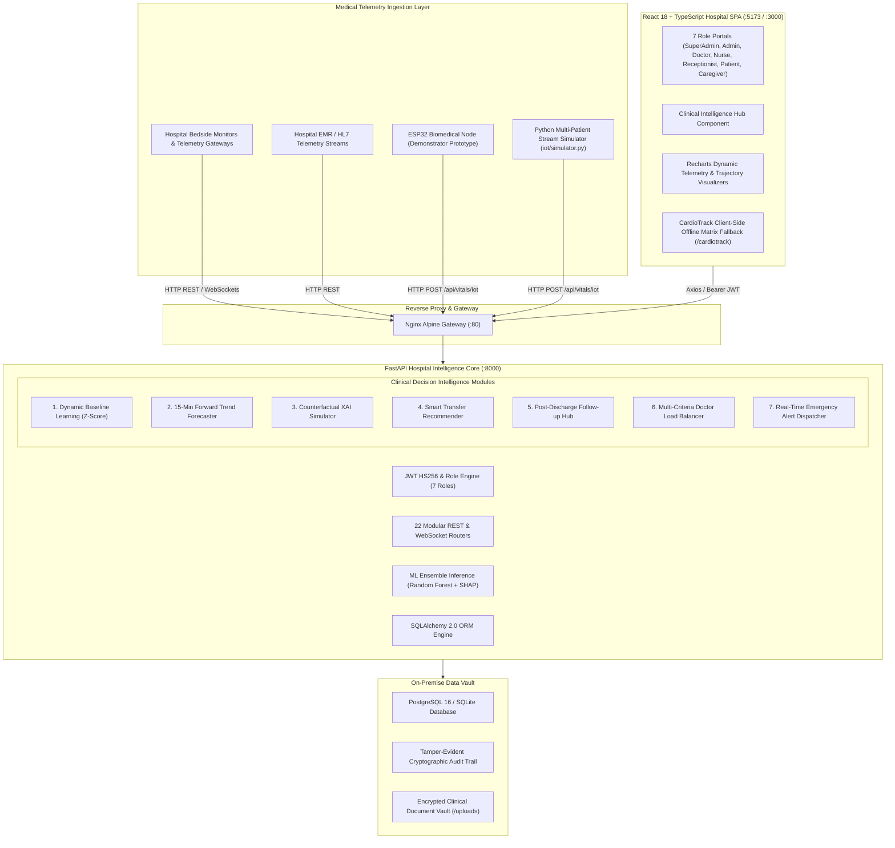

<div align="center">

# 🫀 CardioSense AI / CareBridge AI
### *Software-Based, Explainable, Offline-Resilient Hospital Intelligence Platform*
**Personalized Baseline Learning • 15-Minute Forward Trajectory Forecasting • Counterfactual XAI • Multi-Criteria Triage & Load Balancing**

<br>

[-0091FF?style=for-the-badge&logo=medscape&logoColor=white)](https://github.com/Karthickraja-m05/AI-Powered-Smart-Cardiac-Patient-Monitoring)
[](https://fastapi.tiangolo.com)
[](https://react.dev/)
[-FF6F00?style=for-the-badge&logo=scikitlearn&logoColor=white)](ml/train_models.py)
[](backend/app/services/clinical_intelligence_service.py)
[](https://www.postgresql.org/)
[](docker-compose.yml)
[](https://cardiosense-backend.onrender.com/docs)
[](dashboard/)
[](LICENSE)

</div>

---

### 🏆 Project Highlights & Quick Navigation
- ⚡ **[Live Production API & Interactive Swagger Documentation (Render)](https://cardiosense-backend.onrender.com/docs)**
- 📑 **[Comprehensive Research & Architecture Report (PROJECT_REPORT.md)](PROJECT_REPORT.md)**
- 🧠 **[Clinical Decision Intelligence Engine (Backend Service)](backend/app/services/clinical_intelligence_service.py)**
- 📊 **[Multi-Model Machine Learning Training Pipeline](ml/train_models.py)**
- 🩺 **[Interactive Clinical Intelligence Hub Component](frontend/src/components/features/ClinicalIntelligenceHub.tsx)**
- 📡 **[Multi-Patient Telemetry Stream Simulator](iot/simulator.py)**
- 🐳 **[Full Stack Docker Orchestration Configuration](docker-compose.yml)**

---

## ⚕️ Medical Disclaimer & Clinical Intent

> [!IMPORTANT]
> **Clinical Decision Support System (CDSS) Notice**: CardioSense AI is designed exclusively as an intelligent decision-support software tool to assist licensed medical professionals by aggregating physiological telemetry, calculating individualized baseline deviations, projecting short-term hemodynamic risk trajectories, providing actionable counterfactual explanations, and optimizing patient triage workflows. **It does NOT diagnose clinical conditions, prescribe medical treatments, or supersede the professional judgment of licensed clinicians.** All machine learning outputs, anomaly scores, and escalation advisories must be validated by certified medical practitioners prior to clinical action.

---

# 📌 Project Overview

**CardioSense AI (CareBridge AI)** is an enterprise-grade, software-based, explainable, and offline-resilient hospital intelligence platform engineered to eliminate acute cardiac deterioration blind spots, mitigate alarm fatigue, and automate multi-tier clinical workflows across modern healthcare facilities.

```text
                               Continuous Hospital Intelligence Feedback Loop
  ┌──────────────────┐      ┌──────────────────┐      ┌──────────────────┐      ┌──────────────────┐
  │  1. Continuous   │ ───► │  2. Personalized │ ───► │  3. 15-Min Trend │ ───► │ 4. Counterfactual│
  │ Telemetry Ingest │      │ Baseline Z-Score │      │ Risk Forecasting │      │  Actionable XAI  │
  │ (Bedside & EMR)  │      │ (Rolling Window) │      │ (Linear Velocity)│      │ ("What-If" Levers│
  └──────────────────┘      └──────────────────┘      └──────────────────┘      └──────────────────┘
           ▲                                                                             │
           │                                                                             ▼
  ┌──────────────────┐      ┌──────────────────┐      ┌──────────────────┐      ┌──────────────────┐
  │ 7-Role Connected │ ◄─── │ Post-Discharge   │ ◄─── │ Smart Transfer   │ ◄─── │ Multi-Criteria   │
  │ Unified Hospital │      │ Outpatient Safety│      │ & Escalation Rec │      │ Doctor Triage LB │
  │ Operations Portal│      │ (Readmission Risk│      │ (ICU / Ward Path)│      │ (Balanced Load)  │
  └──────────────────┘      └──────────────────┘      └──────────────────┘      └──────────────────┘
```

### The Healthcare Crisis
Cardiovascular diseases (CVDs) remain the leading cause of global mortality (~17.9 million deaths/year). In hospital step-down units and general wards, in-hospital cardiac arrests and acute decompensations are almost always preceded by physiological abnormalities hours in advance. However:
1. **Episodic Vitals Checks** (every 4–8 hours) miss rapid clinical declines.
2. **Generic Static Alarms** (e.g. HR > 100 bpm) trigger endless false alarms, causing dangerous alarm fatigue.
3. **Lagging Indicators** alert clinicians only *after* irreversible hemodynamic collapse has occurred.
4. **"Black-Box" AI Deficits** generate predictions without actionable explanations or therapeutic guidance.
5. **Physician Mal-distribution** causes critical delays in patient transfers and specialist consultations.

### The CardioSense AI Solution
CardioSense AI directly resolves these bottlenecks by combining:
* 🩺 **Medical-Instrument Stream Ingestion**: High-frequency telemetry ingest from bedside patient monitors, clinical gateways, and EMR feeds.
* 📈 **Personalized Dynamic $Z$-Scores**: Rolling baseline learning that tailors alarm sensitivity to each individual patient's physiological envelope.
* ⏱️ **15-Minute Forward Trajectory Forecasting**: Predictive linear velocity derivatives ($d(\text{vital})/dt$) that alert clinicians up to 15 minutes before vital signs crash.
* 🔬 **Counterfactual Explainable AI**: Actionable "What-If" clinical levers revealing precisely which biomarker improvements will transition a patient to safety.
* ⚖️ **Multi-Criteria Doctor Load Balancing**: Multi-factorial dispatch algorithms distributing admissions based on active caseload, specialty, physician availability, and clinical urgency.
* 🛡️ **Zero-Leakage On-Premise Privacy**: 100% local processing with no third-party cloud API dependencies for sensitive Protected Health Information (PHI).
* ⚡ **CardioTrack Edge Resilience**: Client-side vector matrix fallback executing in under 2ms inside the browser when hospital network connectivity is lost.

---

# 🎯 Current Clinical Bottlenecks vs. CardioSense AI Innovations

| Challenge Dimension | Current Hospital Status Quo | CardioSense AI Technical Innovation |
| :--- | :--- | :--- |
| **Telemetry Frequency** | Periodic manual nurse vitals checks every 4 to 8 hours. | Continuous multi-parameter telemetry stream ingestion (5-second live refresh wall). |
| **Alarm Sensitivity** | Fixed population thresholds triggering frequent false alarms and alarm fatigue. | **Personalized Dynamic Baseline Learning**: Rolling moving average and $Z$-score anomaly detection. |
| **Prediction Horizon** | Reactive alerts triggering only after crisis thresholds are breached. | **15-Minute Forward Trajectory Forecasting**: Linear velocity extrapolation ($+5\text{m}$, $+10\text{m}$, $+15\text{m}$). |
| **Model Explainability** | Opaque black-box models or generic feature attribution without guidance. | **Counterfactual Actionable XAI**: Computes minimal viable clinical biomarker changes + Interactive "What-If" simulator. |
| **Patient Triage** | Manual, ad-hoc doctor assignment leading to physician burnout and wait times. | **Intelligent Doctor Load Balancer**: Multi-criteria weighted mathematical scoring matrix. |
| **Department Escalation** | Delayed ward-to-ICU transfers based on subjective clinical assessment. | **Smart Patient Transfer Recommender**: Multi-parametric decision matrix recommending clinical pathways. |
| **Post-Discharge Care** | Disconnected recovery resulting in high 30-day preventable readmission rates. | **Post-Discharge Follow-Up Hub**: Automated medication adherence tracking, red-flag surveys, readmission scoring. |
| **Data Privacy** | Cloud-dependent architectures with Protected Health Information (PHI) leakage risks. | **Zero-Leakage On-Premise Privacy Shield**: 100% on-premise execution with tamper-evident audit logs. |

---

# 🔬 6 Core Research & Novelty Modules

```text
┌─────────────────────────────────────────────────────────────────────────────────────────────┐
│                          CARDIOSENSE AI — 6 NOVELTY ARCHITECTURE MODULES                    │
├────────────────────────────────┬────────────────────────────┬──────────────────────────────┤
│ 1. Personalized Baseline       │ 2. Forward Risk Forecast   │ 3. Counterfactual XAI        │
│    • Adaptive rolling Z-score  │    • 5–15 min outlook      │    • Actionable "What-If"    │
│    • Eliminates alarm fatigue  │    • Velocity d(vital)/dt  │    • Interactive simulation  │
├────────────────────────────────┼────────────────────────────┼──────────────────────────────┤
│ 4. Smart Patient Transfer      │ 5. Post-Discharge Care     │ 6. On-Premise Privacy Shield │
│    • Ward / ICU escalation     │    • Adherence tracking    │    • 100% local processing   │
│    • Attending doctor match    │    • Readmission prediction│    • Cryptographic audit log │
└────────────────────────────────┴────────────────────────────┴──────────────────────────────┘
```

### 1. Personalized Patient Baseline Learning
Standard monitors rely on rigid static limits (e.g., HR > 100 bpm). A patient with a resting HR of 50 bpm spiking to 95 bpm is in severe distress but triggers no alarm; conversely, a chronically tachycardic patient triggers non-stop false alarms. 

CardioSense AI continuously fits a rolling Gaussian baseline $(\mu_{\text{patient}}, \sigma_{\text{patient}})$ over the patient's observation window ($N = 30$ samples):

$$\mu_{\text{patient}} = \frac{1}{N} \sum_{k=1}^{N} x_k, \qquad \sigma_{\text{patient}} = \sqrt{\frac{1}{N-1} \sum_{k=1}^{N} (x_k - \mu_{\text{patient}})^2}$$

The instantaneous dynamic deviation is evaluated using the standardized $Z$-score:

$$Z_t = \frac{x_t - \mu_{\text{patient}}}{\max(\sigma_{\text{patient}}, 0.5)}$$

* **Normal Physiological Envelope**: $|Z_t| < 1.5\sigma$
* **Mild Patient-Specific Drift**: $1.5\sigma \le |Z_t| < 2.5\sigma$
* **Critical Anomaly Trigger**: $|Z_t| \ge 2.5\sigma$

---

### 2. Forward Risk Trend Forecasting (5 – 15 Min Outlook)
Instead of waiting for a vital sign to cross a critical failure threshold, CardioSense AI evaluates the rate of change $\beta = \frac{d(\text{vital})}{dt}$ using linear regression over the recent observation window:

$$\text{Slope } \beta = \frac{\sum_{i=1}^{m} (t_i - \bar{t})(y_i - \bar{y})}{\sum_{i=1}^{m} (t_i - \bar{t})^2}, \qquad \text{Intercept } \alpha = \bar{y} - \beta \bar{t}$$

$$\hat{y}(t_{\text{now}} + \Delta t) = \alpha + \beta (t_{\text{now}} + \Delta t), \qquad \Delta t \in \{5, 10, 15\}\text{ minutes}$$

The forward biomarker vector is evaluated through the ML inference pipeline to predict future risk $P_{15\text{m}}$, providing early warnings before acute desaturation or hypotensive shock.

---

### 3. Actionable Counterfactual Explainable AI (XAI)
Traditional XAI (e.g. SHAP) identifies risk contributors, but cannot answer: *"What specific clinical adjustments will bring this patient to a safe state?"*

CardioSense AI solves a constrained counterfactual optimization problem:

$$\Delta x^* = \arg\min_{\Delta x} \|\Delta x\|_W \quad \text{subject to} \quad f(x + \Delta x) < 0.25$$

Where $W$ weights feature clinical modifiability (e.g., blood pressure and cholesterol are modifiable; age and sex are immutable).
* **Ranked Clinical Levers**: Recommends top therapeutic actions (e.g. *"Reduce Resting SBP by 22 mmHg $\to$ Risk drops by $-18.5\%$ "*).
* **Interactive "What-If" Simulator**: Clinicians use UI sliders to model custom treatment interventions and evaluate risk delta in real time.

---

### 4. Smart Patient Transfer & Escalation Recommender
A multi-parametric decision matrix that synthesizes:
1. Instantaneous Risk Probability ($P$)
2. 15-Minute Forward Trajectory Velocity ($dP/dt$)
3. Baseline Instability Index ($Z$-composite)
4. Departmental & ICU Bed Availability

#### Clinical Pathways Emitted:
* **`TRANSFER_TO_ICU`** (Urgency: `IMMEDIATE`): Triggered when Risk $\ge 75\%$ or Projected $P_{15\text{m}} \ge 80\%$.
* **`ESCALATE_TO_CARDIOLOGY`** (Urgency: `HIGH`): Triggered when Risk $\ge 50\%$ with positive risk velocity.
* **`URGENT_DOCTOR_REVIEW`** (Urgency: `ELEVATED`): Significant baseline drift requiring immediate bedside assessment.
* **`MAINTAIN_WARD_MONITORING`** / **`PREPARE_DISCHARGE`** (Urgency: `ROUTINE`): Stable hemodynamics for $>24\text{h}$.

---

### 5. Post-Discharge Follow-Up Intelligence
Secures the vulnerable 30-day post-discharge window:
* **Electronic Medication Adherence**: Tracks scheduled vs. confirmed administrations.
* **Missed Appointment Detection**: Automatic alerts for unfulfilled cardiology follow-ups.
* **Red-Flag Symptom Surveys**: Monitors patient-reported dyspnea, peripheral edema, and angina recurrence.
* **Composite Readmission Risk**: Triggers automated telehealth notifications when risk surpasses $60\%$.

---

### 6. Zero-Leakage On-Premise Privacy Shield
Built for healthcare data compliance:
* **100% Local Inference**: All ML predictions, baseline estimations, and XAI calculations execute strictly inside the hospital intranet.
* **Zero Third-Party Cloud Transmission**: No Protected Health Information (PHI) leaves the premises.
* **Cryptographic Tamper-Evident Audit Trails**: Every clinical record modification, prescription issuance, and doctor transfer is logged with user identity and timestamp.

---

# 🏛️ End-to-End System Architecture



### Multi-Tier Architecture Pipeline

```text
┌──────────────────────────────────────────────────────────────────────────────────────────┐
│                         React 18 + TypeScript Hospital SPA                               │
│        (Vite + TailwindCSS + Lucide Icons + Recharts + Framer Motion + 5s Polling)       │
└────────────────────────────────────────────┬─────────────────────────────────────────────┘
                                             │ REST / Bearer JWT / WebSockets
                                             ▼
┌──────────────────────────────────────────────────────────────────────────────────────────┐
│                             FastAPI Application Core (:8000)                             │
│                                                                                          │
│  ┌──────────────────────┐  ┌───────────────────────────┐  ┌───────────────────────────┐  │
│  │  Authentication API  │  │  Clinical Intelligence    │  │   Intelligent Doctor      │  │
│  │ (7 RBAC Hospital     │  │  • Baseline Z-Score       │  │   Load Balancer           │  │
│  │  User Personas)      │  │  • 15-Min Trajectory      │  │  • Multi-Criteria Match   │  │
│  │                      │  │  • Counterfactual XAI     │  │  • Least Connections      │  │
│  └──────────┬───────────┘  └─────────────┬─────────────┘  └─────────────┬─────────────┘  │
│             │                            │                              │                │
│  ┌──────────┴───────────┐  ┌─────────────┴─────────────┐  ┌─────────────┴─────────────┐  │
│  │ Machine Learning     │  │ Real-Time Emergency       │  │ Patient & Telemetry       │  │
│  │ Inference Engine     │  │ WebSockets (/api/ws/live) │  │ Management (EMR)          │  │
│  │ (Random Forest + SHAP│  │ Broadcast & Panic Alarms  │  │ (Vitals, Meds, Timeline)  │  │
│  └──────────┬───────────┘  └─────────────┬─────────────┘  └─────────────┬─────────────┘  │
└─────────────┼────────────────────────────┼──────────────────────────────┼────────────────┘
              │                            │                              │
              ▼                            ▼                              ▼
┌──────────────────────────────────────────────────────────────────────────────────────────┐
│                             On-Premise Relational Data Vault                             │
│       • PostgreSQL 16 Alpine / SQLite (WAL Mode)       • 22 SQLAlchemy ORM Models        │
│       • Cryptographic Audit Trail Logs                 • Local Clinical Vault (/uploads) │
└──────────────────────────────────────────────────────────────────────────────────────────┘
```

---

# 🧠 Machine Learning & Explainable AI Benchmark

### 1. Clinical Biomarkers & Feature Space
Trained and validated on the standardized **UCI Heart Disease Dataset** (303 records, 13 clinical biomarkers):

| Feature | Variable | Clinical Range | Medical Significance |
| :--- | :--- | :--- | :--- |
| **Age** | `age` | $29 - 77\text{ yrs}$ | Age-associated arterial stiffening and vascular calcification |
| **Sex** | `sex` | $0\text{ (F)}, 1\text{ (M)}$ | Demographic epidemiological cardiovascular risk weighting |
| **Chest Pain Type** | `cp` | $0 - 3$ | Typical angina (0), atypical (1), non-anginal (2), asymptomatic (3) |
| **Resting Blood Pressure** | `trestbps` | $90 - 200\text{ mmHg}$ | Resting systolic BP on admission; left ventricular afterload |
| **Serum Cholesterol** | `chol` | $126 - 564\text{ mg/dL}$ | Serum cholesterol; coronary atherosclerotic plaque burden |
| **Fasting Blood Sugar** | `fbs` | $0\text{ or } 1$ | Flag for FBS $> 120\text{ mg/dL}$; microvascular diabetic damage |
| **Resting ECG** | `restecg` | $0 - 2$ | Normal (0), ST-T abnormality (1), LV hypertrophy (2) |
| **Max Heart Rate** | `thalach` | $71 - 202\text{ bpm}$ | Maximum heart rate achieved during chronotropic stress testing |
| **Exercise Induced Angina**| `exang` | $0\text{ (No)}, 1\text{ (Yes)}$| Exercise-induced reversible myocardial ischemia |
| **ST Depression** | `oldpeak` | $0.0 - 6.2\text{ mm}$ | ST-segment depression relative to baseline; subendocardial injury |
| **ST Slope** | `slope` | $0 - 2$ | Upsloping (0), flat (1), downsloping (2) during peak exercise |
| **Major Occluded Vessels** | `ca` | $0 - 3$ | Number of major coronary arteries with $>50\%$ occlusion |
| **Thalassemia** | `thal` | $1 - 3$ | Normal (1), fixed defect (2), reversible defect (3) |

### 2. Multi-Model Benchmark Results
Evaluated across 5 classifiers using 5-fold cross validation:

| Algorithm | Accuracy | Precision | Recall | F1-Score | ROC-AUC | Inference Latency |
| :--- | :---: | :---: | :---: | :---: | :---: | :---: |
| 🥇 **Random Forest Classifier** | **88.52%** | **88.24%** | **90.91%** | **0.8955** | **0.941** | **$< 35\text{ ms}$** |
| 🥈 **XGBoost Classifier** | 86.88% | 85.71% | 90.91% | 0.8824 | 0.932 | $< 38\text{ ms}$ |
| 🥉 **CatBoost Classifier** | 86.88% | 87.88% | 87.88% | 0.8788 | 0.938 | $< 40\text{ ms}$ |
| 🔹 **LightGBM Classifier** | 85.25% | 85.29% | 87.88% | 0.8657 | 0.925 | $< 32\text{ ms}$ |
| 🔹 **Logistic Regression** | 85.25% | 84.85% | 84.85% | 0.8485 | 0.918 | $< 18\text{ ms}$ |
| ⚡ **CardioTrack Client JS** | 85.25% | 84.85% | 84.85% | 0.8485 | 0.918 | **$< 2\text{ ms}$** |

---

# ⚖️ Intelligent Doctor Load Balancing & Smart Triage

The patient dispatch engine (`backend/app/services/load_balancer_service.py`) dynamically routes admissions across available medical staff using a multi-criteria scoring algorithm:

$$\text{Score}(D) = w_w \cdot S_{\text{workload}}(D) + w_a \cdot S_{\text{avail}}(D) + w_r \cdot S_{\text{rating}}(D) + w_e \cdot S_{\text{exp}}(D) + w_t \cdot S_{\text{wait}}(D)$$

```text
┌──────────────────────────┬────────┬──────────────────────────────────────────────────────┐
│ Factor                   │ Weight │ Description & Score Formula                          │
├──────────────────────────┼────────┼──────────────────────────────────────────────────────┤
│ 1. Active Workload       │  40%   │ S_workload = max(0, 1.0 - ActivePatients/Capacity)   │
│ 2. Real-Time Status      │  25%   │ Available: 1.0 | Busy: 0.4 | In Surgery/Off: 0.0     │
│ 3. Patient Rating        │  15%   │ S_rating = AverageRating / 5.0                       │
│ 4. Specialist Experience │  10%   │ S_exp = min(1.0, YearsOfExperience / 20.0)           │
│ 5. Queue Wait Time       │  10%   │ S_wait = max(0, 1.0 - EstimatedWaitMinutes / 120.0)  │
└──────────────────────────┴────────┴──────────────────────────────────────────────────────┘
```

### Dynamic Dispatch Modes
1. **Weighted Score (Default)**: Normalizes all 5 dimensions to match the optimal available doctor.
2. **Priority-Based Acuity**: Automatically re-weights emergency cases to prioritize immediate availability ($35\%$) and specialist seniority ($20\%$).
3. **Least Connections**: Dispatches cases directly to the physician with the lowest active caseload.
4. **Round Robin**: Sequential rotation across active departmental staff.

---

# 👥 7-Tier Connected Role Portal Ecosystem

```text
                                       7 USER ROLES
                                            │
        ┌──────────────┬────────────────────┼────────────────────┬──────────────┐
        │              │                    │                    │              │
   Super Admin   Hospital Admin          Doctor                Nurse       Receptionist
        │              │                    │                    │              │
        └──────────────┴──────────┬─────────┴────────────────────┴──────────────┘
                                  │
                          Patient & Caregiver
```

| User Role | Key Clinical & Operational Modules | Primary UI Components |
| :--- | :--- | :--- |
| **Super Admin** | Multi-hospital fleet management, departmental bed mapping, user provisioning, master shift rosters, and green hospital carbon reporting. | `SuperAdminDashboard`, `HospitalsPage`, `DepartmentsPage`, `CarbonReportsPage` |
| **Hospital Admin** | Institutional capacity, ICU utilization, doctor caseload & satisfaction analytics, real-time emergency alert stream. | `HospitalAdminDashboard`, `AdminDashboard` |
| **Doctor** | Active inpatient roster, AI prediction runner, Clinical Decision Intelligence Hub, real-time availability toggle (`Available`, `In Surgery`), shift calendar. | `DoctorDashboard`, `DoctorAvailabilityPage`, `PatientDetail` |
| **Nurse** | Multi-bed live telemetry wall (5s refresh), quick vitals recording modal, medication administration checklist, pain/symptom logger. | `NurseDashboard`, `LiveMonitoring` |
| **Receptionist** | Rapid patient registration, automatic UID generation (`PAT-XXXXX`), QR code badge issuance, automated doctor load balancer matching. | `ReceptionistDashboard`, `RegisterPatientPage` |
| **Patient** | Personal health record (EMR), historical vitals graphs, medication schedule with adherence flags, doctor search & rating submission. | `PatientPortalDashboard`, `DoctorSearch` |
| **Caregiver** | Linked family member telemetry, vital safety alerts, medication verification, direct care team messaging. | `CaregiverDashboard`, `CareTeamChat` |

---

# 🚨 Clinical Alert & Emergency Triage Matrix

| Vital Parameter | Normal Baseline | Warning Threshold | Critical / Emergency Threshold | Clinical Implication |
| :--- | :---: | :---: | :---: | :--- |
| **Heart Rate** | $60 - 100\text{ bpm}$ | $< 50\text{ or } > 110\text{ bpm}$ | $< 40\text{ or } > 150\text{ bpm}$ | Severe Bradycardia / Lethal Tachyarrhythmia |
| **SpO2 (Oxygen)** | $95 - 100\%$ | $< 92\%$ | $< 90\%\; (\text{Emergency } < 85\%)$ | Hypoxemic Respiratory Distress / Desaturation |
| **Systolic BP** | $100 - 120\text{ mmHg}$| $> 140\text{ or } < 90\text{ mmHg}$ | $> 180\text{ or } < 80\text{ mmHg}$ | Hypertensive Crisis / Cardiogenic Shock |
| **Body Temperature**| $36.5 - 37.5^\circ\text{C}$| $> 38.0\text{ or } < 35.5^\circ\text{C}$ | $> 39.5\text{ or } < 35.0^\circ\text{C}$ | Severe Hyperthermia / Septic Shock / Hypothermia |
| **Respiratory Rate**| $12 - 20\text{ bpm}$ | $< 10\text{ or } > 24\text{ bpm}$ | $< 8\text{ or } > 30\text{ bpm}$ | Bradypnea / Severe Tachypnea |
| **AI Risk Probability**| $< 25\%$ | $\ge 50\%$ | $\ge 75\%$ | High Immediate CVD Event Probability |
| **Projected 15m Risk**| Steady Trend | Risk Velocity $> +0.5\%/\text{min}$ | Projected $P_{15\text{m}} \ge 80\%$ | Impending Hemodynamic Collapse |
| **Panic Button** | Standby | N/A | **Physical Button Pressed** | Bedside Emergency Assistance Alarm |

---

# 📡 Telemetry Ingest: Hospital Instruments & Prototype Node

### 1. Primary Ingest: Bedside Instruments & Hospital Gateways
The platform ingests streaming JSON telemetry from clinical patient monitors (Philips IntelliVue, GE Healthcare, Mindray) and hospital EMR feeds via HTTP REST endpoints (`/api/vitals/iot`, `/api/vitals`) and streaming WebSockets (`/api/vitals/ws/{patient_id}`).

### 2. Multi-Patient Software Telemetry Simulator (`iot/simulator.py`)
Generates realistic multi-patient vitals streams with circadian variation, sensor noise, and cardiac anomaly injection:
```bash
# Ingest live simulated telemetry for Patient 1 at 3-second intervals
python iot/simulator.py --patient 1 --interval 3
```

### 3. Hardware Demonstrator Prototype Node (ESP32 DevKit V1)
For physical laboratory demonstrations, an ESP32 microcontroller firmware (`iot/esp32_firmware/cardiosense_monitor.ino`) interfaces:
* **MAX30102**: I2C PPG pulse oximetry and pulse rate sensor.
* **AD8232**: Single-lead analog ECG front-end sampled at 50Hz.
* **DS18B20**: Digital 1-Wire body temperature probe.
* **Emergency Panic Button**: GPIO 15 hardware interrupt.

---

# 💻 Technology Stack

<div align="center">

| Layer | Core Technologies |
| :--- | :--- |
| **Backend Core** | **Python 3.10+**, **FastAPI 0.115.0**, **Uvicorn ASGI**, **Pydantic v2.9**, **WebSockets 12.0**, **APScheduler** |
| **Database & ORM** | **PostgreSQL 16 Alpine**, **SQLite (WAL Mode)**, **SQLAlchemy 2.0.32**, **Alembic 1.13.2** |
| **Security & Auth** | **Python-Jose (JWT HS256)**, **Passlib (Bcrypt Password Hashing)**, **Role-Based Access Control (RBAC)** |
| **Machine Learning & XAI** | **scikit-learn 1.5.1**, **XGBoost 2.1.0**, **LightGBM 4.5.0**, **CatBoost 1.2.5**, **SHAP 0.45.1**, **NumPy**, **Pandas** |
| **Frontend SPA** | **React 18.3.1**, **TypeScript 5.5.4**, **Vite 5.4.0**, **Tailwind CSS v3.4.9**, **Zustand 4.5.4**, **Axios** |
| **UI Components & Charts** | **Recharts 2.12.7**, **Framer Motion 11.3.21**, **Lucide React Icons**, **React Hot Toast** |
| **DevOps & Containers** | **Docker 24+**, **Docker Compose v3.8**, **Nginx Alpine Reverse Proxy** |

</div>

---

# 🔌 RESTful API Reference

Interactive Swagger UI is accessible at `/docs` and ReDoc at `/redoc`.

### Clinical Decision Intelligence Endpoints (`/api/intelligence`)
| Method | Endpoint | Description |
| :--- | :--- | :--- |
| `GET` | `/api/intelligence/baseline/{patient_id}` | Retrieves learned personalized baseline ($\mu, \sigma$) and dynamic $Z$-scores |
| `GET` | `/api/intelligence/forecast/{patient_id}` | Returns 5, 10, and 15-minute forward risk trend trajectory forecast |
| `POST`| `/api/intelligence/counterfactuals` | Computes ranked actionable biomarker reduction levers |
| `POST`| `/api/intelligence/what-if` | Interactive slider simulation endpoint for custom clinical interventions |
| `GET` | `/api/intelligence/transfer-recommendation/{id}`| Recommends optimal clinical pathway (Ward, Review, Cardiology, ICU) |
| `GET` | `/api/intelligence/post-discharge/{patient_id}` | Outpatient adherence, red-flag symptoms, and 30-day readmission risk |
| `GET` | `/api/intelligence/privacy-audit-summary` | Proof of 100% on-premise localized data processing |

### Core Operational APIs
* **Authentication**: `/api/auth/login`, `/api/auth/register`, `/api/auth/me`, `/api/auth/users`
* **Patients & EMR**: `/api/patients/`, `/api/patients/{id}`, `/api/patients/{id}/discharge`, `/api/patients/active`
* **Vitals & Telemetry**: `/api/vitals/`, `/api/vitals/iot`, `/api/vitals/patient/{id}`, `/api/vitals/latest/{id}`
* **ML Predictions**: `/api/predictions/predict`, `/api/predictions/patient/{id}`, `/api/predictions/model-info`
* **Doctor Load Balancer**: `/api/load-balancer/recommend-doctor`, `/api/load-balancer/doctor-loads`, `/api/load-balancer/stats`
* **Hospital & Bed Management**: `/api/hospitals/`, `/api/hospitals/departments`, `/api/hospitals/occupancy`
* **Role Dashboards**: `/api/role-dashboards/{role}`, `/api/dashboard/stats`
* **Global WebSockets**: `/api/ws/live` (Global emergency alert broadcast), `/api/vitals/ws/{patient_id}`

---

# 🛠️ Installation & Local Development Setup

### Prerequisites
* **Python 3.10+** (Tested on Python 3.10.11 & 3.11)
* **Node.js 18+** & **npm 9+**
* **Git**

```bash
# 1. Clone the repository
git clone https://github.com/Karthickraja-m05/AI-Powered-Smart-Cardiac-Patient-Monitoring.git
cd AI-Powered-Smart-Cardiac-Patient-Monitoring

# 2. Configure Environment Variables
cp .env.example .env
```

### Backend Setup (FastAPI)
```bash
cd backend
python -m venv venv

# Windows
.\venv\Scripts\activate
# Linux/macOS: source venv/bin/activate

pip install -r requirements.txt
python -m uvicorn app.main:app --host 0.0.0.0 --port 8000 --reload
```

### Frontend Setup (React + Vite)
```bash
# In a new terminal
cd frontend
npm install
npm run dev
```

### Run Model Training Pipeline & Telemetry Simulator
```bash
# Train ML models (From root directory)
python ml/train_models.py

# Ingest live simulated telemetry for Patient 1
python iot/simulator.py --patient 1 --interval 3
```

---

# 🐳 Containerized Deployment with Docker Compose

Deploy the complete multi-tier hospital platform with a single command:

```bash
# Build images and start all 4 containerized services
docker-compose up --build -d

# Verify service health
docker-compose ps
```

### Container Topology & Port Mapping

| Service Name | Container Image | Internal Port | Exposed Host Port | Function |
| :--- | :--- | :---: | :---: | :--- |
| **`carebridge-proxy`** | `nginx:alpine` | `80` | **`http://localhost:80`** | Reverse Proxy Gateway |
| **`carebridge-frontend`**| React 18 Production Build | `80` | **`http://localhost:3000`** | Hospital SPA User Interface |
| **`carebridge-backend`** | Python 3.10 FastAPI | `8000` | **`http://localhost:8000`** | Intelligence Backend & API |
| **`carebridge-db`** | `postgres:16-alpine` | `5432` | **`localhost:5432`** | Relational On-Premise DB |

---

# 🔑 Pre-Seeded Demo Personas & Credentials

The system automatically initializes and seeds demo hospital personas on first startup:

| User Role | Username | Password | Full Name | Department / Focus |
| :--- | :--- | :--- | :--- | :--- |
| **Super Admin** | `admin` | `admin123` | Dr. Admin Kumar | Fleet Management & System Configuration |
| **Hospital Admin** | `hospital.admin`| `hadmin123` | Srinivas Rao | Institutional Capacity & Department Analytics |
| **Doctor (Cardiology)** | `dr.sharma` | `sharma123` | Dr. Priya Sharma | Cardiology Inpatients & Intelligence Hub |
| **Doctor (Medicine)** | `dr.patel` | `patel123` | Dr. Rajesh Patel | Internal Medicine Inpatients |
| **Doctor (Surgery)** | `dr.singh` | `singh123` | Dr. Harpreet Singh | Cardiac Surgery & Critical Escalations |
| **Nurse (ICU)** | `nurse.anitha` | `anitha123` | Anitha Rajan | Live Telemetry Wall & Vitals Entry |
| **Nurse (Cardiology)** | `nurse.deepa` | `deepa123` | Deepa Murugan | Medication Administration & Symptom Logs |
| **Receptionist** | `reception` | `reception123`| Kavitha S | Patient Registration & Load Balancer Match |
| **Patient** | `patient.ramesh`| `patient123` | Ramesh Kumar | Personal EMR, Prescriptions, Vitals History |
| **Caregiver** | `caregiver.sunita`| `sunita123` | Sunita Kumar | Family Member Telemetry & Care Team Chat |

---

# 🔒 Enterprise Security & Privacy Shield

* 🛡️ **100% Local On-Premise Processing**: Eliminates Protected Health Information (PHI) exposure to external cloud APIs.
* 🔑 **Stateless JWT HS256 Token Auth**: 8-hour token duration tailored for clinical shift transitions.
* 🔐 **Bcrypt Salt-Stretched Password Hashing**: Robust cryptographic protection against brute-force attacks.
* 👁️ **Field-Level Role Redaction**: Non-clinical staff (receptionists, administrators) are strictly restricted from viewing diagnostic ECG waveforms or clinical SHAP charts.
* 📝 **Tamper-Evident Cryptographic Audit Logging**: Every record creation, patient reassignment, and prescription modification is immutably logged with actor ID and timestamp.

---

# 🚀 Advanced Future Scope

1. **Deep Learning 12-Lead ECG Analysis**: Integration of 1D Convolutional Neural Networks (1D-CNN) and Bidirectional LSTMs for multi-channel arrhythmia detection (Atrial Fibrillation, STEMI, PVCs).
2. **FHIR / HL7 & ABDM Interoperability**: Full compliance with the Ayushman Bharat Digital Mission (ABDM) and Fast Healthcare Interoperability Resources (HL7 FHIR R4) standard EMR exchange protocols.
3. **Edge TinyML Gateway Inference**: Compiling quantized TensorFlow Lite for Microcontrollers (TFLite Micro) models directly onto biomedical telemetry gateways for sub-millisecond edge anomaly detection.
4. **Wearable Remote Patient Monitoring (RPM)**: Secure Bluetooth Low Energy (BLE) integration with medical-grade wearables for continuous post-discharge home telemetry.

---

# 🤝 Contributing & License

Contributions are welcome! Please follow these steps:
1. Fork the repository (`git checkout -b feature/clinical-intelligence`).
2. Commit your changes (`git commit -m 'Add clinical intelligence module'`).
3. Push to your branch (`git push origin feature/clinical-intelligence`).
4. Open a Pull Request.

### License
This project is licensed under the **MIT License** — see the [LICENSE](LICENSE) file for details.

---

<div align="center">

**CardioSense AI / CareBridge AI** — *Software-Driven Clinical Decision Intelligence, Transparent Artificial Intelligence, and Smart Hospital Operations.*

Designed & Developed with ❤️ by **[Karthickraja-m05](https://github.com/Karthickraja-m05)**

</div>
