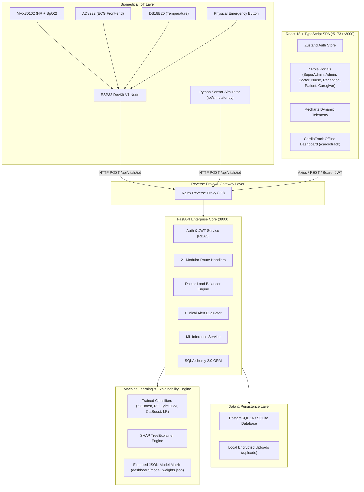

# 🫀 CardioSense AI / CareBridge AI
### *AI-Powered Smart Cardiac Patient Monitoring & Clinical Decision Support System*

[](https://fastapi.tiangolo.com)
[](https://reactjs.org/)
[](https://vitejs.dev/)
[](https://tailwindcss.com/)
[](https://scikit-learn.org/)
[](https://github.com/slundberg/shap)
[](https://www.espressif.com/)
[](https://www.postgresql.org/)
[](https://www.docker.com/)

---

## ⚕️ Medical Disclaimer & Clinical Intent

> [!IMPORTANT]
> **Clinical Decision Support Only**: CardioSense AI (CareBridge AI) is an experimental and clinical decision support system designed to assist healthcare professionals by aggregating vital telemetry, estimating cardiovascular risk probabilities, and providing contextual explainability. **It does NOT diagnose medical conditions, formulate final treatment plans, or replace the professional judgment of licensed clinicians.** All machine learning inferences and alert notifications must be validated by certified medical practitioners before clinical intervention.

---

## 📑 Table of Contents

1. [Executive Summary](#-executive-summary)
2. [Key System Features](#-key-system-features)
3. [End-to-End System Architecture](#-end-to-end-system-architecture)
4. [Machine Learning & Explainable AI (XAI)](#-machine-learning--explainable-ai-xai)
5. [IoT Hardware & Telemetry Pipeline](#-iot-hardware--telemetry-pipeline)
6. [7-Tier Role-Based Portals & Workflows](#-7-tier-role-based-portals--workflows)
7. [Intelligent Doctor Load Balancer](#-intelligent-doctor-load-balancer)
8. [Clinical Alert & Emergency Triage System](#-clinical-alert--emergency-triage-system)
9. [Technology Stack](#-technology-stack)
10. [Database Schema & Entity Relationship](#-database-schema--entity-relationship)
11. [RESTful API Reference](#-restful-api-reference)
12. [Project Directory Structure](#-project-directory-structure)
13. [Installation & Local Setup](#-installation--local-setup)
14. [Docker & Containerized Deployment](#-docker--containerized-deployment)
15. [Demo Credentials & Personas](#-demo-credentials--personas)
16. [Security, Auditability & Compliance](#-security-auditability--compliance)
17. [Contributing & License](#-contributing--license)

---

## 🌟 Executive Summary

CardioSense AI is an enterprise-grade, full-stack Hospital Intelligence Platform and Smart Cardiac Patient Monitoring System. It bridges the gap between real-time embedded biomedical hardware, predictive machine learning pipelines, and clinical hospital operations.

Modern cardiac care units face critical challenges: delayed anomaly detection, clinician cognitive overload, unoptimized doctor-to-patient allocation, and fragmented patient timelines. CardioSense AI addresses these challenges through:
- **Continuous IoT Telemetry**: Continuous, sub-3-second streaming of heart rate, SpO2, blood pressure, body temperature, respiratory rate, and live single-lead ECG waveforms directly from ESP32 biomedical nodes.
- **Explainable Multi-Model AI Risk Scoring**: Automated risk stratification (Low, Medium, High, Critical) using ensemble models (Random Forest, XGBoost, LightGBM, CatBoost, Logistic Regression) with SHAP (SHapley Additive exPlanations) to provide clinicians with transparent, biomarker-level risk attribution.
- **Smart Patient Triage & Doctor Load Balancing**: Healthcare-tailored load balancing algorithms (Weighted Score, Least Connections, Round Robin, Acuity Priority) that dispatch incoming patients to the best available doctors based on workload, real-time status, specialization, and ratings.
- **Role-Based Hospital Operations**: Dedicated, secure portals for 7 distinct stakeholder roles: Super Admin, Hospital Admin, Doctors, Nurses, Receptionists, Patients, and Caregivers.
- **Zero-Connectivity Edge Fallback (CardioTrack)**: A standalone offline dashboard with embedded mathematical weight matrices enabling offline risk predictions when cloud connectivity is unavailable.

---

## 🚀 Key System Features

```
┌─────────────────────────────────────────────────────────────────────────────┐
│                             CARDIOSENSE AI PLATFORM                         │
├──────────────────────┬──────────────────────┬───────────────────────────────┤
│  Biomedical Telemetry │  Predictive AI (XAI) │  Hospital Operations (7 Roles)│
│  • 3s Ingest Cycle   │  • 5 ML Classifiers  │  • Super Admin & Multi-Tenant │
│  • 50Hz ECG Stream   │  • SHAP Attribution  │  • Doctor Load Balancer       │
│  • Anomaly Alerts    │  • 4 Risk Tiers      │  • ICU Priority Board         │
│  • Panic Pushbutton  │  • Offline Weights   │  • Visitor & Timeline EMR     │
└──────────────────────┴──────────────────────┴───────────────────────────────┘
```

- **Real-Time Live Telemetry Dashboard**: Real-time auto-refreshing vitals monitoring, color-coded health badges, and interactive historical charting using Recharts and Framer Motion.
- **Automated Clinical Alerting Engine**: Threshold-based alarms for Bradycardia, Tachycardia, Hypoxemia, Hypertensive Crisis, Hyperthermia, Tachypnea, Bradypnea, AI risk thresholds ($P \ge 0.50$), and physical emergency button triggers.
- **Doctor Load Balancing Engine**: Algorithmic patient distribution preventing physician burnout and reducing patient emergency room wait times.
- **ICU Priority Board**: Acuity scoring combining physiological vital instability and ML cardiovascular risk to identify high-urgency ICU bed candidates.
- **Patient Timeline & Care Team Chat**: Audit-logged clinical event streams (admissions, vitals, prescriptions, transfers, discharges) and real-time internal hospital communication.
- **Visitor Pass Management**: Digital badge generation, QR verification, visitor check-in/check-out tracking, and hospital security compliance.
- **Sustainability & Green Hospital Intelligence**: Paperless digital EMR tracking and carbon emission reduction metrics (kg CO₂ saved per hospital).

---

## 🏛️ End-to-End System Architecture



---

## 🧠 Machine Learning & Explainable AI (XAI)

### 1. Clinical Training Dataset
The models are trained and validated on the benchmark **UCI Heart Disease Dataset** (Cleveland Database) supplemented with standardized clinical biomarker features:

| Feature Index | Biomarker / Feature Name | Description | Clinical Value Domain |
| :--- | :--- | :--- | :--- |
| `age` | Patient Age | Age in years | 29 – 77 |
| `sex` | Biological Sex | 1 = Male; 0 = Female | Binary |
| `cp` | Chest Pain Type | 0: Typical Angina, 1: Atypical Angina, 2: Non-anginal, 3: Asymptomatic | 0 – 3 |
| `trestbps` | Resting Blood Pressure | Resting SBP on admission (mmHg) | 94 – 200 mmHg |
| `chol` | Serum Cholesterol | Serum cholestoral in mg/dl | 126 – 564 mg/dl |
| `fbs` | Fasting Blood Sugar | FBS > 120 mg/dl (1 = true; 0 = false) | Binary |
| `restecg` | Resting ECG Results | 0: Normal, 1: ST-T wave abnormality, 2: Left ventricular hypertrophy | 0 – 2 |
| `thalach` | Max Heart Rate Achieved | Maximum heart rate achieved during stress | 71 – 202 bpm |
| `exang` | Exercise Induced Angina | 1 = Yes; 0 = No | Binary |
| `oldpeak` | ST Depression | ST depression induced by exercise relative to rest | 0.0 – 6.2 mm |
| `slope` | Peak Exercise ST Slope | 0: Upsloping, 1: Flat, 2: Downsloping | 0 – 2 |
| `ca` | Major Vessels Colored | Number of major vessels (0-3) colored by flourosopy | 0 – 3 |
| `thal` | Thalassemia Status | 1 = Normal; 2 = Fixed Defect; 3 = Reversible Defect | 1 – 3 |

### 2. Multi-Model Comparison & Evaluation Pipeline
The pipeline (`ml/train_models.py`) evaluates multiple classification algorithms through stratified 80/20 train/test splits and 5-fold cross validation:
1. **Random Forest Classifier**: Ensemble of 200 balanced decision trees.
2. **XGBoost Classifier**: Gradient boosted trees with tuned learning rates ($0.1$) and max depth ($5$).
3. **LightGBM Classifier**: Leaf-wise tree growth with fast execution.
4. **CatBoost Classifier**: Optimized categorical feature handling.
5. **Logistic Regression (L2 Regularized)**: Interpretable baseline and export source.

The pipeline computes Accuracy, Precision, Recall, and F1-Score, automatically persisting the top-performing model as `ml/models/best_model.pkl` along with its fitted `StandardScaler` (`ml/models/scaler.pkl`).

### 3. Risk Stratification Tiers
Predictions yield a continuous probability score $P \in [0.0, 1.0]$ categorized into 4 clinical tiers:
- 🟢 **LOW RISK (0% – 24%)**: Physiological vitals stable, routine ambulatory follow-up.
- 🟡 **MEDIUM RISK (25% – 49%)**: Mild biomarkers elevation; regular vitals logging recommended.
- 🟠 **HIGH RISK (50% – 74%)**: Significant risk factor clustering; triggers clinical notification.
- 🔴 **CRITICAL RISK (75% – 100%)**: Severe cardiovascular abnormality; immediate clinical consult & ICU alert.

### 4. Explainable AI (SHAP TreeExplainer)
Rather than acting as a black box, the inference service (`backend/app/services/prediction_service.py`) calculates exact **SHAP values** for every prediction. It identifies and ranks the **Top-5 Risk Factors** contributing to the risk score (e.g., *ST Depression (oldpeak)*, *Chest Pain Type*, *Maximum Heart Rate*), rendering them as visual impact bars for clinicians.

### 5. CardioTrack: Offline Client-Side Inference Engine
For rural clinics or connectivity blackout scenarios, the standalone `dashboard/` module computes risk directly in browser memory using exported Logistic Regression coefficients (`model_weights.json`):

$$\text{Logit}(z) = \beta_0 + \sum_{i=1}^{13} \beta_i \cdot \left( \frac{x_i - \mu_i}{\sigma_i} \right)$$

$$P(\text{Heart Disease}) = \frac{1}{1 + e^{-z}}$$

---

## 📡 IoT Hardware & Telemetry Pipeline

### 1. Hardware Sensor Setup (ESP32)
The IoT node (`iot/esp32_firmware/cardiosense_monitor.ino`) interfaces with biomedical sensors:
- **ESP32 DevKit V1**: Dual-core 240MHz microcontroller with onboard 2.4GHz Wi-Fi.
- **MAX30102 Module**: I2C pulse oximetry and heart-rate optical sensor (SDA $\to$ GPIO 21, SCL $\to$ GPIO 22).
- **AD8232 Heart Rate Monitor**: Single-lead ECG front-end analog sensor connected to ADC GPIO 34 sampling at 50Hz.
- **DS18B20**: High-precision Dallas 1-Wire digital temperature sensor on GPIO 4 with a 4.7kΩ pull-up resistor.
- **Emergency Alert Pushbutton**: Hardware interrupt connected to GPIO 15 with active-low internal pull-up.

```
                  ┌──────────────────────────────┐
                  │        ESP32 DEVKIT V1       │
                  │                              │
[MAX30102 (PPG)] ─┤ GPIO 21 (SDA)  GPIO 22 (SCL) ├─ I2C Bus (HR & SpO2)
[AD8232 (ECG)]   ─┤ GPIO 34 (Analog ADC)         ├─ 50Hz ECG Waveform Buffer
[DS18B20 (Temp)] ─┤ GPIO 4  (1-Wire Bus)         ├─ Precision Temperature
[Panic Button]   ─┤ GPIO 15 (Active LOW)         ├─ Instant Emergency Interrupt
                  └──────────────┬───────────────┘
                                 │ Wi-Fi HTTP POST (JSON Payload)
                                 ▼
                     /api/vitals/iot (FastAPI)
```

### 2. IoT Telemetry Payload Example
```json
{
  "patient_id": 1,
  "device_id": "ESP32-BED-101",
  "heart_rate": 78.4,
  "spo2": 98.2,
  "temperature": 36.8,
  "bp_systolic": 122.0,
  "bp_diastolic": 79.0,
  "respiratory_rate": 16.0,
  "pain_level": 2.0,
  "stress_level": 1.0,
  "ecg_data": [512, 515, 520, 508, 620, 780, 420, 510, 512, 515],
  "emergency": false
}
```

### 3. Software Simulator (`iot/simulator.py`)
For testing without physical hardware, the simulator generates multi-patient vitals streams with:
- **Circadian Rhythm Modeling**: Sinusoidal drift representing diurnal hemodynamic changes.
- **Stochastic Noise**: Gaussian distribution simulating patient movement and sensor jitter.
- **Anomaly Injection**: Randomized 1% probability triggers for acute tachycardia, hypoxemia, or hypotensive events.

---

## 👥 7-Tier Role-Based Portals & Workflows

CardioSense AI implements strict Role-Based Access Control (RBAC) with dedicated UX portals:

```
                                  USER ROLES
                                      │
     ┌──────────────┬─────────────────┼─────────────────┬──────────────┐
     │              │                 │                 │              │
Super Admin   Hospital Admin       Doctor             Nurse      Receptionist
     │              │                 │                 │              │
     └──────────────┴────────┬────────┴─────────────────┴──────────────┘
                             │
                     Patient & Caregiver
```

### 1. 👑 Super Admin Portal (`/superadmin/*`)
- Multi-hospital fleet management: register hospital entities, manage bed capacities, and configure tenant settings.
- Departmental mapping: assign wings, floor levels, bed counts, and head physicians.
- Global user management: provision user accounts across all roles, toggle access, and reset credentials.
- Shift management: oversee doctor and nurse master shift rosters.
- Sustainability intelligence: track hospital paperless emission reductions (kg CO₂ saved).

### 2. 🏥 Hospital Admin Portal (`/hospitaladmin/*`)
- Institution-wide KPI metrics: aggregate occupancy, ICU utilization, emergency admission velocity.
- Doctor performance metrics: average consultation times, active caseloads, patient satisfaction ratings.
- Real-time departmental alert feed and incident monitoring.

### 3. 👨‍⚕️ Doctor Portal (`/doctor/*`)
- Active patient caseload roster with one-click access to medical history and vitals charts.
- AI Risk Prediction Hub: trigger on-demand ML evaluations, inspect SHAP biomarker attribution, and review prediction history.
- Personal availability status toggle (`Available`, `Busy`, `In Surgery`, `Emergency`, `Meeting`, `Off Duty`, `Vacation`) with return-time estimates.
- Personal schedule and on-call shift calendar.
- Digital prescription and medication ordering.

### 4. 👩‍⚕️ Nurse Portal (`/nurse/*`)
- Real-time multi-bed live telemetry monitor with 5-second auto-refresh and abnormal vitals highlighting.
- Fast vital recording modal (manual clinical input + IoT sync).
- Medication administration logger (record doses given, missed, scheduled).
- Patient symptom and pain score logger (0–10 scale).

### 5. 📋 Receptionist Portal (`/receptionist/*`, `/register`)
- Rapid patient registration with demographic entry, medical history checkboxes, and emergency contact details.
- Automated unique UID generation (`PAT-XXXXX`) and dynamic patient QR code issuance.
- Automated smart doctor assignment powered by the Doctor Load Balancer.
- Outpatient appointment scheduling and check-in processing.

### 6. 🧑‍🦽 Patient Portal (`/patient/*`)
- Personal health record view: historical vitals, diagnosis summaries, and medical history.
- Medication schedule with adherence status and doctor instructions.
- Upcoming consultation appointments view.
- Verified doctor search and physician rating submission (1–5 stars + feedback).

### 7. 🤝 Caregiver Portal (`/caregiver/*`)
- Linked patient monitoring dashboard for family members and authorized caregivers.
- Real-time vitals status and safety alerts.
- Medication adherence verification.
- Direct messaging access with the assigned clinical care team.

---

## ⚖️ Intelligent Doctor Load Balancer

The platform includes an intelligent patient dispatch engine (`backend/app/services/load_balancer_service.py`) that matches patients with the optimal physician.

### Algorithms Supported
1. **Weighted Score Algorithm (Default)**: Multi-factor evaluation scoring each candidate doctor:
   
   $$\text{Score} = w_{\text{workload}} \cdot S_{\text{workload}} + w_{\text{avail}} \cdot S_{\text{avail}} + w_{\text{rating}} \cdot S_{\text{rating}} + w_{\text{exp}} \cdot S_{\text{exp}} + w_{\text{wait}} \cdot S_{\text{wait}}$$
   
   *Default Weights*: Workload ($40\%$), Availability ($25\%$), Rating ($15\%$), Experience ($10\%$), Wait Time ($10\%$).

2. **Priority-Based Acuity Algorithm**: Dynamically shifts evaluation weights based on patient urgency (e.g., for *Critical* cases, availability and doctor experience weights increase to $35\%$ and $20\%$).
3. **Least Connections**: Dispatches to the qualified doctor with the lowest active patient count.
4. **Round Robin**: Cycles sequentially across active doctors in the department.

---

## 🚨 Clinical Alert & Emergency Triage System

The alert evaluation service continuously screens every incoming vital reading against clinical thresholds:

| Vital Parameter | Warning Threshold | Critical / Emergency Threshold | Clinical Condition |
| :--- | :--- | :--- | :--- |
| **Heart Rate** | $< 50$ or $> 110$ bpm | $< 40$ or $> 150$ bpm | Bradycardia / Extreme Tachycardia |
| **SpO2 (Oxygen)** | $< 92\%$ | $< 90\%$ (Emergency if $< 85\%$) | Severe Hypoxemia |
| **Systolic BP** | $> 140$ or $< 90$ mmHg | $> 180$ or $< 80$ mmHg | Hypertensive Crisis / Severe Hypotension |
| **Temperature** | $> 38.0^\circ\text{C}$ or $< 35.5^\circ\text{C}$ | $> 39.5^\circ\text{C}$ (Critical if $> 40.5^\circ\text{C}$) | Severe Hyperthermia / Hypothermia |
| **Respiratory Rate** | $< 10$ or $> 24$ bpm | $< 8$ or $> 30$ bpm | Bradypnea / Severe Tachypnea |
| **AI Risk Score** | $\ge 50\%$ (High) | $\ge 75\%$ (Critical) | High Cardiovascular Event Probability |
| **Hardware Panic** | N/A | GPIO 15 Pressed | Physical Bedside Emergency Alarm |

All alerts are classified by severity (`info`, `warning`, `critical`, `emergency`), stored in the database, broadcasted to active dashboards, and require mandatory clinical acknowledgment.

---

## 💻 Technology Stack

### Backend
- **Core Framework**: FastAPI `0.115.0` (Asynchronous ASGI)
- **ASGI Server**: Uvicorn `0.30.6`
- **ORM & Migrations**: SQLAlchemy `2.0.32` & Alembic `1.13.2`
- **Data Validation**: Pydantic `v2.9.0` & Pydantic Settings `2.5.0`
- **Security & Auth**: Python-Jose `3.3.0` (JWT HS256), Passlib `1.7.4` (Bcrypt)
- **WebSockets**: Websockets `12.0`
- **Document Generation**: ReportLab `4.2.2` (PDFs), OpenPyXL `3.1.5` (Excel), QRCode `7.4.2`

### Machine Learning
- **Core ML**: scikit-learn `1.5.1`, NumPy `1.26.4`, Pandas `2.2.2`, Joblib `1.4.2`
- **Gradient Boosting**: XGBoost `2.1.0`, LightGBM `4.5.0`, CatBoost `1.2.5`
- **Explainability**: SHAP `0.45.1`

### Frontend
- **Framework & Language**: React `18.3.1` with TypeScript `5.5.4`
- **Build Tool**: Vite `5.4.0`
- **Routing**: React Router DOM `v6.26.0`
- **State Management**: Zustand `v4.5.4`
- **Styling**: Tailwind CSS `v3.4.9`, Lucide React Icons, PostCSS, Autoprefixer
- **Visualizations**: Recharts `2.12.7`, Framer Motion `11.3.21`
- **Notifications**: React Hot Toast `2.4.1`

### IoT & Firmware
- **Platform**: ESP32 DevKit V1 via Arduino IDE / ESP-IDF
- **Sensors**: MAX30102 (I2C), AD8232 (Analog ECG), DS18B20 (OneWire)
- **Communication**: Wi-Fi 802.11 b/g/n, HTTP REST JSON, ArduinoJson `6.x`

### Database & DevOps
- **Databases**: SQLite (Development) / PostgreSQL 16 Alpine (Production)
- **Reverse Proxy**: Nginx Alpine
- **Containerization**: Docker & Docker Compose `3.8`

---

## 🗄️ Database Schema & Entity Relationship

```
 ┌──────────────┐       ┌──────────────┐       ┌──────────────┐
 │  Hospitals   │──1:N──│ Departments  │──1:N──│    Users     │
 └──────────────┘       └──────────────┘       └──────────────┘
                                                       │
                                                  1:N (Doctor)
                                                       │
 ┌──────────────┐       ┌──────────────┐               ▼
 │  Alerts      │──N:1──│   Patients   │◀──1:N──┌──────────────┐
 └──────────────┘       └──────────────┘        │ Appointments │
        │                      │                └──────────────┘
        │               1:N ┌──┼──┐ 1:N
        │                   │  │  │
        ▼                   ▼  ▼  ▼
 ┌──────────────┐ ┌──────────┐ ┌──────────────┐ ┌──────────────┐
 │ VitalSigns   │ │Predict'ns│ │ Medications  │ │ Symptoms     │
 └──────────────┘ └──────────┘ └──────────────┘ └──────────────┘
```

The database model layer contains 22 SQLAlchemy entities:
1. **`users`**: System credentials, role, contact info, specialization, experience, average rating, workload.
2. **`patients`**: Complete demographic record, UID, room/bed assignment, medical history, risk flags, assigned doctor/nurse/caregiver.
3. **`vitals`**: High-frequency time-series vital sign readings, ECG waveform buffers, pain/stress levels, sensor source.
4. **`predictions`**: AI risk score, probability, risk level, SHAP values dictionary, top risk factors list.
5. **`alerts`**: Clinical alert events, trigger source (threshold, AI, emergency button), severity, resolved status.
6. **`medications`**: Prescriptions, dosage, route, frequency, administration schedule, total/given/missed doses.
7. **`symptoms`**: Patient symptom records, severity, onset date, notes.
8. **`hourly_logs`**: Aggregated hourly vitals for efficient long-term trend analysis.
9. **`appointments`**: Outpatient and follow-up booking slots, status, reason.
10. **`notifications`**: User-specific operational notifications.
11. **`hospitals`**: Hospital details, bed counts, carbon footprint metrics.
12. **`departments`**: Wards/departments, floor, wing, bed counts, head physician ID.
13. **`doctor_availability`**: Live clinician status (`available`, `busy`, `in_surgery`, etc.) and return-time estimations.
14. **`doctor_shifts` & `nurse_shifts`**: Shift allocations (`morning`, `evening`, `night`, `on_call`), attendance logs.
15. **`transfers`**: Inter-departmental and inter-facility patient transfer requests and audit trail.
16. **`chat_messages`**: Real-time care team communication threads.
17. **`visitors`**: Visitor records, badge IDs, entry/exit timestamps, approved by user ID.
18. **`doctor_ratings`**: Patient reviews, star ratings (1–5), clinical feedback comments.
19. **`audit_logs`**: Tamper-evident operational and medical record modification logs.
20. **`patient_documents`**: Lab reports, X-rays, ECG recordings, discharge summaries.
21. **`timeline_events`**: Chronological clinical events for patient timeline rendering.
22. **`load_balancer_configs` & `doctor_assignment_logs`**: Load balancing weight configurations and historical doctor dispatch records.

---

## 🔌 RESTful API Reference

Interactive Swagger UI documentation is available at `/docs` and ReDoc at `/redoc`.

### Authentication & Profiles (`/api/auth`)
| Method | Endpoint | Description | Access |
| :--- | :--- | :--- | :--- |
| `POST` | `/api/auth/login` | Authenticate with username/password; returns JWT | Public |
| `POST` | `/api/auth/register` | Register a new user account | Public / Admin |
| `GET` | `/api/auth/me` | Fetch authenticated user profile | Authenticated |
| `PUT` | `/api/auth/profile` | Update profile information | Authenticated |
| `GET` | `/api/auth/users` | List users with role filter | Admin / Staff |

### Patient EMR Management (`/api/patients`)
| Method | Endpoint | Description | Access |
| :--- | :--- | :--- | :--- |
| `GET` | `/api/patients` | Paginated patient list with search & status filters | Staff |
| `POST` | `/api/patients` | Register new patient (triggers UID & QR creation) | Staff |
| `GET` | `/api/patients/{id}` | Detailed patient record with medical history | Authenticated |
| `PUT` | `/api/patients/{id}` | Update patient medical & demographic record | Staff |
| `DELETE` | `/api/patients/{id}` | Soft delete / archive patient | Admin |
| `POST` | `/api/patients/{id}/discharge`| Process formal clinical discharge | Doctor / Admin |

### Telemetry & Vital Signs (`/api/vitals`)
| Method | Endpoint | Description | Access |
| :--- | :--- | :--- | :--- |
| `POST` | `/api/vitals` | Manually record vital signs reading | Nurse / Doctor |
| `POST` | `/api/vitals/iot` | Ingest streaming vitals from ESP32 or simulator | Public / IoT |
| `GET` | `/api/vitals/{patient_id}` | Fetch vitals history with time-range filter | Staff / Patient |
| `GET` | `/api/vitals/{patient_id}/latest`| Fetch instantaneous latest vitals reading | Staff / Patient |

### Machine Learning Predictions (`/api/predictions`)
| Method | Endpoint | Description | Access |
| :--- | :--- | :--- | :--- |
| `POST` | `/api/predictions` | Run multi-model inference & SHAP calculation | Doctor / Staff |
| `GET` | `/api/predictions/{patient_id}` | Historical prediction logs for a patient | Doctor / Staff |
| `GET` | `/api/predictions/{patient_id}/latest`| Latest AI risk assessment & biomarker breakdown | Doctor / Staff |

### Intelligent Load Balancer (`/api/load-balancer`)
| Method | Endpoint | Description | Access |
| :--- | :--- | :--- | :--- |
| `POST` | `/api/load-balancer/assign` | Compute optimal doctor match & assign patient | Receptionist / Admin |
| `GET` | `/api/load-balancer/preview` | Preview candidate doctor scores for a patient | Staff |
| `GET` | `/api/load-balancer/doctor-loads` | Real-time workload & availability of all doctors | Staff |
| `GET` | `/api/load-balancer/stats` | Assignment distribution statistics | Admin |

### Clinical Dashboards & Alerts (`/api/dashboard`)
| Method | Endpoint | Description | Access |
| :--- | :--- | :--- | :--- |
| `GET` | `/api/dashboard/stats` | Hospital-wide summary KPI counts | Staff |
| `GET` | `/api/dashboard/charts` | Historical admissions and risk distribution data | Staff |
| `GET` | `/api/dashboard/alerts` | Active clinical alert feed | Staff |
| `POST` | `/api/dashboard/alerts/{id}/acknowledge`| Clinically acknowledge an active alert | Doctor / Nurse |

### Role Dashboards (`/api/role-dashboards`)
| Method | Endpoint | Description | Access |
| :--- | :--- | :--- | :--- |
| `GET` | `/api/role-dashboards/super-admin` | Multi-hospital fleet KPIs and carbon reports | Super Admin |
| `GET` | `/api/role-dashboards/hospital-admin` | Hospital-level bed occupancy & doctor ratings | Hospital Admin |
| `GET` | `/api/role-dashboards/doctor` | Doctor's active patient list & pending predictions | Doctor |
| `GET` | `/api/role-dashboards/nurse` | Assigned ward vitals monitor & overdue meds | Nurse |
| `GET` | `/api/role-dashboards/patient` | Personal vitals, prescriptions, appointments | Patient |
| `GET` | `/api/role-dashboards/caregiver` | Linked family member status & care team chat | Caregiver |
| `GET` | `/api/role-dashboards/receptionist` | Today's check-ins, available doctors, queue | Receptionist |

### Operational Routers
- **Doctor Availability**: `/api/availability/*` (Update status, search doctors by specialty)
- **Shift Scheduling**: `/api/shifts/*` (Doctor and nurse roster management)
- **Care Team Chat**: `/api/chat/*` (Internal clinical instant messaging)
- **Visitor Management**: `/api/visitors/*` (Visitor pass generation, check-in/out)
- **Doctor Ratings**: `/api/ratings/*` (Submit reviews, calculate average ratings)
- **Patient Transfers**: `/api/transfers/*` (Inter-departmental patient handoff)
- **Audit Logs**: `/api/audit/*` (Tamper-evident system activity log)
- **Patient Documents**: `/api/documents/*` (File upload and document management)
- **Patient Timeline**: `/api/timeline/*` (Chronological EMR event stream)
- **Appointments**: `/api/appointments/*` (Booking and scheduling workflows)
- **Hospitals & Departments**: `/api/hospitals/*` (Fleet and department configuration)

---

## 📂 Project Directory Structure

```
PBL_ML_Project/
├── .env.example                     # Environment template configuration
├── .gitignore                       # Git ignore specifications
├── PROJECT_DESCRIPTION.txt          # Reference project description
├── README.md                        # Complete project documentation
├── docker-compose.yml               # Multi-container Docker orchestration
├── nginx.conf                       # Production reverse proxy configuration
├── heart.csv                        # UCI Heart Disease benchmark dataset
├── heart_model.pkl                  # Serialized standalone model artifact
├── scaler.pkl                       # Serialized feature standard scaler
├── train_model.py                   # Standalone root training script
│
├── backend/                         # FastAPI Application Root
│   ├── Dockerfile                   # Backend Docker build instructions
│   ├── requirements.txt             # Full backend dependencies
│   ├── requirements_light.txt       # Minimal footprint dependencies
│   └── app/
│       ├── __init__.py
│       ├── main.py                  # App entry point, lifespan, CORS, static mounts
│       ├── config.py                # Pydantic Settings env loader
│       ├── database.py              # SQLAlchemy engine & session factory
│       ├── seed.py                  # Demo data generator (hospitals, users, vitals)
│       ├── models/                  # 22 SQLAlchemy ORM Database Entities
│       ├── schemas/                 # Pydantic Request & Response Schemas
│       ├── routers/                 # 21 Modular REST API Route Handlers
│       └── services/                # Core Business Logic & Algorithms
│           ├── alert_service.py     # Vital threshold validation & alert generator
│           ├── auth_service.py      # JWT issuance, password hashing & verification
│           ├── load_balancer_service.py # 4-algorithm doctor dispatch engine
│           └── prediction_service.py# Scikit-Learn / XGBoost / SHAP inference
│
├── frontend/                        # React 18 + TypeScript SPA Root
│   ├── Dockerfile                   # Frontend Nginx production container
│   ├── index.html                   # HTML entry point with Google Fonts
│   ├── package.json                 # Frontend dependencies & scripts
│   ├── vite.config.ts               # Vite configuration & backend proxy
│   ├── tailwind.config.js           # Theme colors, typography, glassmorphism
│   └── src/
│       ├── App.tsx                  # Main router & role-based route guards
│       ├── main.tsx                 # DOM mount entry
│       ├── index.css                # Custom CSS design system
│       ├── types/index.ts           # Unified TypeScript interfaces
│       ├── store/authStore.ts       # Zustand persistent authentication store
│       ├── services/api.ts          # Axios client with auto-JWT interceptors
│       ├── components/
│       │   ├── common/              # Reusable UI primitives
│       │   ├── features/            # Feature widgets (ICU Board, Visitor, Chat, etc.)
│       │   └── layouts/             # RoleBasedLayout & sidebar navigation
│       └── pages/
│           ├── LoginPage.tsx        # Login screen with one-click demo credentials
│           ├── AdminDashboard.tsx   # Classic Admin Analytics
│           ├── PatientList.tsx      # Filterable Patient Directory
│           ├── PatientDetail.tsx    # Comprehensive EMR & Telemetry View
│           ├── LiveMonitoring.tsx   # Real-Time Bedside Monitoring Wall
│           ├── AppointmentsPage.tsx # Master Appointment Scheduling
│           ├── superadmin/          # 6 Super Admin Management Pages
│           ├── hospitaladmin/       # Hospital Admin Overview Dashboard
│           ├── doctor/              # Doctor Dashboard, Shifts, Availability
│           ├── nurse/               # Nurse Ward Telemetry & Meds Dashboard
│           ├── receptionist/        # Reception Dashboard & Patient Registration
│           ├── patient/             # Patient Portal Health Records
│           └── caregiver/           # Caregiver Family Monitoring Dashboard
│
├── ml/                              # Machine Learning Module
│   ├── train_models.py              # Multi-model comparison & evaluation pipeline
│   └── models/                      # Saved production model artifacts & metrics
│
├── iot/                             # Biomedical Embedded Systems
│   ├── simulator.py                 # Multi-patient streaming telemetry simulator
│   └── esp32_firmware/
│       └── cardiosense_monitor.ino  # ESP32 C++ Arduino firmware
│
└── dashboard/                       # Standalone Offline Fallback Engine (CardioTrack)
    ├── index.html                   # Offline responsive UI
    ├── app.js                       # Client-side JavaScript matrix inference
    ├── style.css                    # Embedded glassmorphic styles
    ├── model_weights.json           # Exported logistic regression weights
    └── export_model_weights.py      # Weight matrix exporter utility
```

---

## 🛠️ Installation & Local Setup

### 1. Prerequisites
- **Python 3.10+** (Python 3.11 recommended)
- **Node.js 18+** and **npm 9+**
- **Git**
- *(Optional)* **Arduino IDE 2.x** with ESP32 board package for hardware deployment.
- *(Optional)* **Docker & Docker Compose** for containerization.

---

### 2. Environment Configuration
Clone the repository and prepare the environment configuration:

```bash
# Clone the repository
git clone https://github.com/Karthickraja-m05/AI-Powered-Smart-Cardiac-Patient-Monitoring.git
cd AI-Powered-Smart-Cardiac-Patient-Monitoring

# Copy the environment template
cp .env.example .env
```

---

### 3. Backend Setup (FastAPI)

```bash
# Navigate to backend directory
cd backend

# Create and activate a Python virtual environment
python -m venv venv

# On Windows:
.\venv\Scripts\activate
# On Linux / macOS:
# source venv/bin/activate

# Install dependencies
pip install -r requirements.txt

# Launch FastAPI development server (auto-reloads and seeds demo data)
python -m uvicorn app.main:app --host 0.0.0.0 --port 8000 --reload
```
The backend starts at `http://localhost:8000`. Database tables and demo data are initialized automatically upon startup.

---

### 4. Frontend Setup (React + Vite)

Open a new terminal window:

```bash
# Navigate to frontend directory
cd frontend

# Install Node dependencies
npm install

# Start Vite development server
npm run dev
```
Open your browser at `http://localhost:5173`.

---

### 5. Running the Machine Learning Training Pipeline

To train, compare, and benchmark all ML models on the dataset:

```bash
# From the root directory:
python ml/train_models.py
```
This trains Random Forest, XGBoost, LightGBM, CatBoost, and Logistic Regression, logging comparison metrics and saving the best model to `ml/models/best_model.pkl`.

To export updated model weights to the offline dashboard:
```bash
python dashboard/export_model_weights.py
```

---

### 6. Running the IoT Telemetry Simulator

To simulate streaming biomedical vitals from ESP32 nodes without physical hardware:

```bash
# Send live vitals stream for Patient ID 1
python iot/simulator.py --patient 1 --interval 3

# Simulate vitals for Patient ID 2
python iot/simulator.py --patient 2 --device ESP32-ICU-02
```

---

### 7. Flashing Physical ESP32 Hardware

1. Open `iot/esp32_firmware/cardiosense_monitor.ino` in the Arduino IDE.
2. In `Tools > Board`, select **ESP32 Dev Module**.
3. Install required libraries via Library Manager:
   - `ArduinoJson` (v6.x)
   - `Adafruit MAX30100` / `MAX30105`
   - `DallasTemperature` & `OneWire`
4. Update your Wi-Fi credentials in the sketch:
   ```cpp
   const char* ssid = "YOUR_WIFI_SSID";
   const char* password = "YOUR_WIFI_PASSWORD";
   const char* serverUrl = "http://YOUR_LOCAL_IP:8000/api/vitals/iot";
   ```
5. Connect your ESP32 via USB and click **Upload**.

---

## 🐳 Docker & Containerized Deployment

Deploy the full stack (FastAPI Backend, React Frontend, PostgreSQL 16, and Nginx Reverse Proxy) using Docker Compose:

```bash
# Build images and start containers in the background
docker-compose up --build -d

# View real-time container logs
docker-compose logs -f

# Stop and remove containers
docker-compose down
```

### Container Port Mapping

| Container Name | Service | Internal Port | Exposed Host Port |
| :--- | :--- | :--- | :--- |
| `carebridge-proxy` | Nginx Gateway | `80` | `http://localhost:80` |
| `carebridge-frontend`| React Production SPA | `80` | `http://localhost:3000` |
| `carebridge-backend` | FastAPI ASGI Server | `8000` | `http://localhost:8000` |
| `carebridge-db` | PostgreSQL 16 Database | `5432` | `localhost:5432` |

---

## 🔑 Demo Credentials & Personas

The database is pre-seeded with sample accounts across all roles. Click any user badge on the Login Page (`/login`) or enter the credentials below:

| Role | Username | Password | Full Name | Department / Access Scope |
| :--- | :--- | :--- | :--- | :--- |
| **Super Admin** | `admin` | `admin123` | Dr. Admin Kumar | Enterprise Fleet Management & Setup |
| **Hospital Admin** | `hospital.admin`| `hadmin123` | Srinivas Rao | Hospital Analytics, Bed Occupancy |
| **Doctor (Cardiology)** | `dr.sharma` | `sharma123` | Dr. Priya Sharma | Cardiology Inpatients & AI Predictions |
| **Doctor (Medicine)** | `dr.patel` | `patel123` | Dr. Rajesh Patel | Internal Medicine Inpatients |
| **Doctor (Surgery)** | `dr.singh` | `singh123` | Dr. Harpreet Singh | Cardiac Surgery & Pre-op Care |
| **Nurse (ICU)** | `nurse.anitha` | `anitha123` | Anitha Rajan | Live Telemetry & Vitals Logging |
| **Nurse (Cardiology)** | `nurse.deepa` | `deepa123` | Deepa Murugan | Ward Meds & Symptom Tracking |
| **Receptionist** | `reception` | `reception123`| Kavitha S | Patient Check-in & Doctor Matching |
| **Patient** | `patient.ramesh`| `patient123` | Ramesh Kumar | Personal EMR, Prescriptions, Vitals |
| **Caregiver (Spouse)** | `caregiver.sunita`| `sunita123` | Sunita Kumar | Family Member Telemetry & Care Chat |

---

## 🔒 Security, Auditability & Compliance

- **Stateless JWT Authentication**: Secure OAuth2 Password Bearer token flow with 8-hour expiration for hospital shift continuity.
- **Bcrypt Password Hashing**: Passlib implementation with salt stretching.
- **CORS Protection**: Origin control configurable via `.env`.
- **Tamper-Evident Audit Trails**: Automatic recording of sensitive medical updates (status changes, doctor assignments, prescription administration, patient discharges).
- **Patient Privacy**: RBAC policies restrict patient record access to assigned medical personnel, patients, and authorized caregivers.

---

## 🤝 Contributing & License

### Contributing
Contributions are welcome! To contribute:
1. Fork the repository.
2. Create your feature branch (`git checkout -b feature/clinical-enhancement`).
3. Commit your changes (`git commit -m 'Add clinical enhancement feature'`).
4. Push to the branch (`git push origin feature/clinical-enhancement`).
5. Open a Pull Request.

### License
This project is licensed under the **MIT License**. See the `LICENSE` file for details.

---

<p align="center">
  <b>CardioSense AI / CareBridge AI</b> — Transforming Cardiac Care with Real-Time Telemetry & Transparent Artificial Intelligence.
</p>
