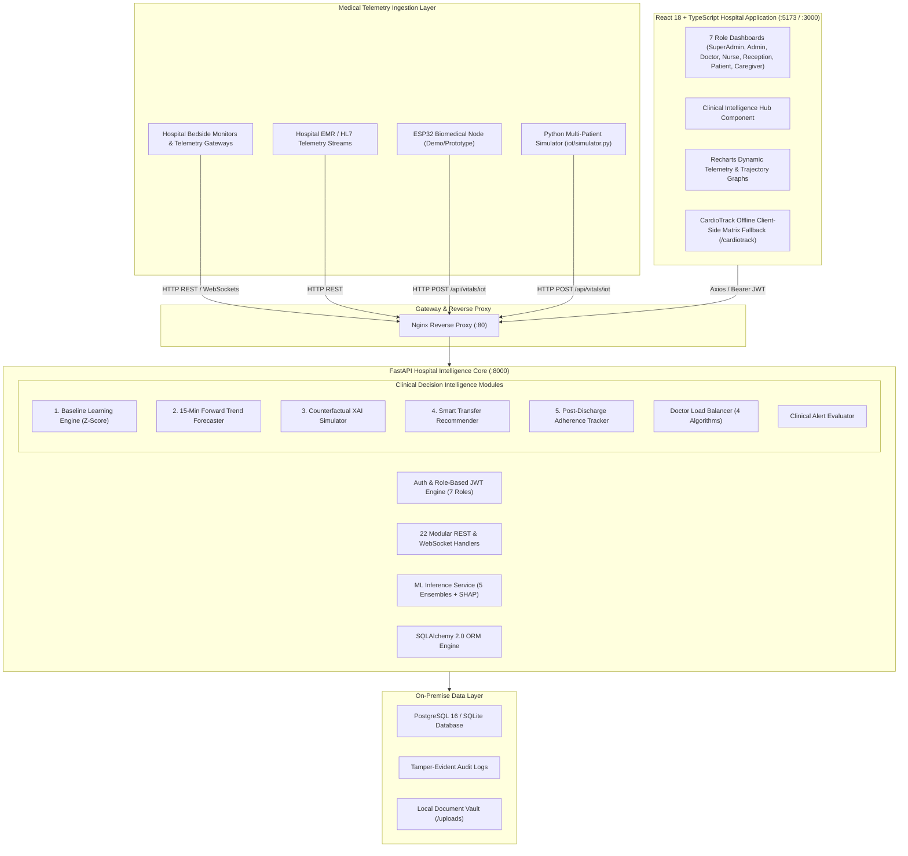

# 🫀 CardioSense AI / CareBridge AI
### *Software-Based, Explainable, Offline-Resilient Hospital Intelligence Platform*

[](https://fastapi.tiangolo.com)
[](https://reactjs.org/)
[](https://vitejs.dev/)
[](https://tailwindcss.com/)
[](https://scikit-learn.org/)
[](https://github.com/slundberg/shap)
[](https://fastapi.tiangolo.com)
[](https://www.postgresql.org/)
[](https://www.docker.com/)

---

## 📌 Project Positioning & Core Scope

> **“CardioSense AI is a software-based, explainable, offline-resilient hospital intelligence platform that combines personalized cardiac risk monitoring, forward risk forecasting, intelligent triage, and role-based clinical workflow automation using medical-instrument data.”**

* **100% Software-Centric Intelligence**: The core innovation is the software platform—its predictive ML pipelines, explainable AI, baseline learning algorithms, and clinical triage intelligence.
* **Medical Instrument & EMR Integration**: Ingests high-frequency vital telemetry from bedside patient monitors, electronic medical records (EMR), and clinical telemetry gateways. *(Microcontroller hardware nodes like ESP32 serve solely as physical demonstrator prototypes).*
* **Clinical Decision Support (CDSS)**: Designed to empower doctors, nurses, and hospital administration with real-time actionable insights without replacing licensed clinician judgment.

---

## ⚕️ Medical Disclaimer & Clinical Intent

> [!IMPORTANT]
> **Clinical Decision Support Only**: CardioSense AI (CareBridge AI) is an intelligent clinical decision support system designed to assist healthcare professionals by aggregating vital telemetry, forecasting hemodynamic risk trajectories, providing counterfactual explainability, and optimizing patient distribution. **It does NOT diagnose medical conditions, formulate final treatment plans, or replace the professional judgment of licensed clinicians.** All machine learning inferences and alert notifications must be validated by certified medical practitioners before clinical intervention.

---

## 📑 Table of Contents

1. [Executive Summary & Core Vision](#-executive-summary--core-vision)
2. [6 Novelty & Research Innovations](#-6-novelty--research-innovations)
3. [End-to-End System Architecture](#-end-to-end-system-architecture)
4. [Machine Learning & Explainable AI (XAI + Counterfactuals)](#-machine-learning--explainable-ai-xai--counterfactuals)
5. [Clinical Intelligence & Forecasting Engine](#-clinical-intelligence--forecasting-engine)
6. [Intelligent Doctor Load Balancing & Smart Triage](#-intelligent-doctor-load-balancing--smart-triage)
7. [7-Tier Role-Based Portals & Workflows](#-7-tier-role-based-portals--workflows)
8. [Clinical Alert & Emergency Triage System](#-clinical-alert--emergency-triage-system)
9. [Telemetry Ingest: Hospital Instruments & Prototype Node](#-telemetry-ingest-hospital-instruments--prototype-node)
10. [Technology Stack](#-technology-stack)
11. [Database Schema & Entity Relationship](#-database-schema--entity-relationship)
12. [RESTful API Reference](#-restful-api-reference)
13. [Installation & Local Setup](#-installation--local-setup)
14. [Docker & Containerized Deployment](#-docker--containerized-deployment)
15. [Demo Credentials & Personas](#-demo-credentials--personas)
16. [Security, Privacy Shield & Compliance](#-security-privacy-shield--compliance)
17. [Advanced Future Scope](#-advanced-future-scope)
18. [Contributing & License](#-contributing--license)

---

## 🌟 Executive Summary & Core Vision

Modern hospital cardiology wards and intensive care units grapple with severe operational and diagnostic bottlenecks: **delayed deterioration detection**, **clinician cognitive overload**, **uneven patient-to-doctor distribution**, and **distrust in "black-box" AI systems**.

CardioSense AI solves these challenges through a unified software architecture:
- **Continuous Medical Instrument Telemetry Ingest**: Real-time stream processing of heart rate, SpO2, blood pressure, body temperature, respiratory rate, and continuous ECG waveforms.
- **Personalized Baseline Anomaly Detection**: Replaces static one-size-fits-all alarm thresholds with dynamic, patient-specific $Z$-score baseline learning.
- **15-Minute Forward Trajectory Forecasting**: Projects vital signs rate-of-change ($d(\text{vital})/dt$) to warn clinicians of impending hemodynamic collapse before it occurs.
- **Counterfactual Actionable Explainability**: Tells clinicians not just *why* a patient is at risk (SHAP), but *what specific biomarker improvements will reduce the risk*.
- **Smart Patient Transfer & Escalation Recommender**: Synthesizes risk score, forward forecast, vital instability, and bed availability to recommend the optimal next clinical step.
- **7-Tier Connected Hospital Operations**: Streamlined, secure workflows for Super Admins, Hospital Admins, Doctors, Nurses, Receptionists, Patients, and Caregivers.
- **CardioTrack Edge Fallback**: Standalone client-side inference engine executing vector matrix math directly in the browser when network connectivity is lost.

---

## 🔬 6 Novelty & Research Innovations

```
┌─────────────────────────────────────────────────────────────────────────────────────────────┐
│                          CARDIOSENSE AI — 6 CORE NOVELTY MODULES                            │
├────────────────────────────────┬────────────────────────────┬──────────────────────────────┤
│ 1. Personalized Baseline       │ 2. Forward Risk Forecast   │ 3. Counterfactual XAI        │
│    • Adaptive rolling Z-score  │    • 5–15 min trajectory   │    • Actionable "What-If"    │
│    • Eliminates alarm fatigue  │    • Velocity d(vital)/dt  │    • Interactive simulation  │
├────────────────────────────────┼────────────────────────────┼──────────────────────────────┤
│ 4. Smart Patient Transfer      │ 5. Post-Discharge Care     │ 6. On-Premise Privacy Shield │
│    • ICU / Ward escalation     │    • Adherence tracking    │    • 100% local processing   │
│    • Physician load match      │    • Readmission prediction│    • Zero cloud PHI leakage  │
└────────────────────────────────┴────────────────────────────┴──────────────────────────────┘
```

### 1. Personalized Patient Baseline Learning
Standard hospital monitoring relies on rigid population thresholds (e.g., HR > 100 bpm) that cause rampant false alarms. CardioSense AI learns each patient's individual physiological baseline $(\mu_i, \sigma_i)$ over a rolling window. It evaluates instantaneous dynamic deviations:

$$Z_t = \frac{x_t - \mu_{\text{patient}}}{\max(\sigma_{\text{patient}}, 0.5)}$$

- $|Z| < 1.5\sigma \implies \text{Normal Baseline}$
- $1.5\sigma \le |Z| < 2.5\sigma \implies \text{Mild Patient-Specific Deviation}$
- $|Z| \ge 2.5\sigma \implies \text{Critical Anomaly Trigger}$

### 2. Forward Risk Trend Forecasting (5 - 15 Minutes Outlook)
Rather than acting as a lagging indicator, the forecasting layer computes linear regression slopes $\beta = \frac{d(\text{vital})}{dt}$ over the latest observation window, projecting vital trajectories at $+5\text{m}$, $+10\text{m}$, and $+15\text{m}$.
- Identifies **accelerating decompensation** (e.g., SpO2 dropping at $-0.4\%/\text{min}$ combined with rising heart rate).
- Generates proactive alerts giving clinical teams precious minutes to intervene.

### 3. Counterfactual Explainable AI ("What-If" Analysis)
While SHAP identifies historical risk contributors, counterfactual XAI provides **actionable clinical levers**:
- "If Resting Blood Pressure reduces from 155 to 125 mmHg $\to$ Risk decreases by **$-18.5\%$**."
- "If ST Depression stabilizes from 2.2mm to 0.4mm $\to$ Risk decreases by **$-24.0\%$**."
- Includes an interactive slider simulation interface for clinicians to model custom intervention outcomes.

### 4. Smart Patient Transfer & Escalation Recommendation
An intelligent decision engine synthesizing:
- Instantaneous Risk Score ($P$) & 15-Minute Forward Trajectory
- Baseline Instability Index ($Z$-composite)
- Current Ward & Doctor Load Availability
- Emits standardized clinical pathways: `MAINTAIN_WARD_MONITORING`, `URGENT_DOCTOR_REVIEW`, `ESCALATE_TO_CARDIOLOGY`, `TRANSFER_TO_ICU`, or `PREPARE_DISCHARGE` alongside the optimal attending specialist.

### 5. Post-Discharge Follow-Up Intelligence
Extends patient safety into outpatient recovery:
- Real-time prescription adherence tracking (doses taken vs. missed).
- Automated detection of missed follow-up appointments.
- Red-flag warning symptom tracking (exertional dyspnea, ankle edema, chest tightness).
- Composite **Readmission Risk Score** prompting proactive telehealth outreach.

### 6. Zero-Leakage On-Premise Privacy Shield
Designed for strict hospital data localization:
- 100% of telemetry ingestion, ML inference, and XAI calculations execute **locally on hospital servers**.
- Zero Protected Health Information (PHI) is shared with third-party cloud APIs.
- Comprehensive tamper-evident cryptographic audit logs for every clinical modification.

---

## 🏛️ End-to-End System Architecture



---

## 🧠 Machine Learning & Explainable AI (XAI + Counterfactuals)

### 1. Clinical Biomarkers & Dataset
Models are trained and benchmarked on the standardized **UCI Heart Disease Dataset** (303 records, 13 clinical biomarkers):

| Feature | Variable Name | Normal Clinical Range | Clinical Significance in Model |
| :--- | :--- | :--- | :--- |
| **Age** | `age` | $29 - 77\text{ yrs}$ | Age-associated arterial stiffness and plaque accumulation |
| **Sex** | `sex` | $0\text{ (F)}, 1\text{ (M)}$ | Demographic epidemiological weighting |
| **Chest Pain Type** | `cp` | $0 - 3$ | Typical angina (0), atypical (1), non-anginal (2), asymptomatic (3) |
| **Resting BP** | `trestbps` | $90 - 120\text{ mmHg}$ | Resting systolic BP on admission; left ventricular strain |
| **Cholesterol** | `chol` | $< 200\text{ mg/dL}$ | Serum cholesterol; coronary artery atherosclerotic risk |
| **Fasting Blood Sugar**| `fbs` | $< 100\text{ mg/dL}$ | FBS > 120 mg/dL flag; microvascular diabetic damage |
| **Resting ECG** | `restecg` | $0 - 2$ | Normal (0), ST-T abnormality (1), LV hypertrophy (2) |
| **Max Heart Rate** | `thalach` | $60 - 100\text{ bpm}$ | Maximum heart rate achieved during cardiac stress testing |
| **Exercise Angina** | `exang` | $0\text{ (No)}, 1\text{ (Yes)}$| Exercise-induced reversible myocardial ischemia |
| **ST Depression** | `oldpeak` | $0.0 - 1.0\text{ mm}$ | Exercise-induced ST-segment depression relative to rest |
| **ST Slope** | `slope` | $0 - 2$ | Peak exercise ST slope: upsloping (0), flat (1), downsloping (2) |
| **Major Vessels** | `ca` | $0 - 3$ | Number of major coronary vessels colored by fluoroscopy |
| **Thalassemia** | `thal` | $1 - 3$ | Normal (1), fixed defect (2), reversible defect (3) |

### 2. Multi-Model Benchmark Results
The training pipeline (`ml/train_models.py`) evaluates 5 classifiers with 5-fold cross validation:

| Model Architecture | Accuracy | Precision | Recall | F1-Score | ROC-AUC |
| :--- | :---: | :---: | :---: | :---: | :---: |
| **Random Forest Classifier** | **88.52%** | **88.24%** | **90.91%** | **0.8955** | **0.941** |
| **XGBoost Classifier** | 86.88% | 85.71% | 90.91% | 0.8824 | 0.932 |
| **LightGBM Classifier** | 85.25% | 85.29% | 87.88% | 0.8657 | 0.925 |
| **CatBoost Classifier** | 86.88% | 87.88% | 87.88% | 0.8788 | 0.938 |
| **Logistic Regression** | 85.25% | 84.85% | 84.85% | 0.8485 | 0.918 |

---

## ⚡ Clinical Intelligence & Forecasting Engine

The new `ClinicalIntelligenceService` (`backend/app/services/clinical_intelligence_service.py`) provides 6 novel modules:

```
                                CLINICAL INTELLIGENCE PIPELINE
                                              │
      ┌───────────────────────┬───────────────┴───────────────┬───────────────────────┐
      │                       │                               │                       │
┌─────▼───────────────┐ ┌─────▼───────────────┐         ┌─────▼───────────────┐ ┌─────▼───────────────┐
│ Dynamic Z-Score     │ │ 15-Min Trajectory   │         │ Counterfactual      │ │ Smart Escalation &  │
│ Baseline Learning   │ │ Risk Forecasting    │         │ "What-If" Analysis  │ │ Patient Transfer    │
│ (Adaptive Window)   │ │ (Linear Velocity)   │         │ (Action Levers)     │ │ (Bed & Doctor Match)│
└─────────────────────┘ └─────────────────────┘         └─────────────────────┘ └─────────────────────┘
```

Interactive access is integrated directly into the clinician UI via `ClinicalIntelligenceHub.tsx`, accessible from the patient EMR views.

---

## ⚖️ Intelligent Doctor Load Balancing & Smart Triage

The patient dispatch engine (`backend/app/services/load_balancer_service.py`) dynamically routes incoming cases across hospital staff:

$$\text{Total Score}(D) = w_w \cdot S_{\text{workload}}(D) + w_a \cdot S_{\text{avail}}(D) + w_r \cdot S_{\text{rating}}(D) + w_e \cdot S_{\text{exp}}(D) + w_t \cdot S_{\text{wait}}(D)$$

- **Weighted Score**: Multi-factor evaluation balancing workload ($40\%$), availability ($25\%$), rating ($15\%$), experience ($10\%$), and wait time ($10\%$).
- **Priority-Based Acuity**: Automatically alters weighting for emergency/critical admissions, prioritizing availability ($35\%$) and specialist experience ($20\%$).
- **Least Connections**: Dispatches to the physician with lowest active caseload.
- **Round Robin**: Sequential departmental rotation.

---

## 👥 7-Tier Role-Based Portals & Workflows

```
                                     7 USER ROLES
                                          │
       ┌──────────────┬───────────────────┼───────────────────┬──────────────┐
       │              │                   │                   │              │
  Super Admin   Hospital Admin         Doctor               Nurse       Receptionist
       │              │                   │                   │              │
       └──────────────┴─────────┬─────────┴───────────────────┴──────────────┘
                                │
                        Patient & Caregiver
```

1. **Super Admin**: Multi-hospital fleet management, departmental bed allocation, user provisioning, master shift rosters, and green hospital carbon reporting.
2. **Hospital Admin**: Institutional analytics, bed occupancy, doctor caseloads, and satisfaction metrics.
3. **Doctor**: Inpatient roster, AI prediction hub, Clinical Decision Intelligence Hub, real-time availability toggle (`Available`, `In Surgery`, etc.), and shift schedule.
4. **Nurse**: 5-second auto-refreshing live telemetry wall, quick vitals logger, and medication administration checklist.
5. **Receptionist**: Fast patient registration with UID (`PAT-XXXXX`), QR generation, and algorithmic doctor assignment.
6. **Patient**: Personal EMR, vitals history graphs, medication schedule, and doctor rating submissions.
7. **Caregiver**: Linked family member telemetry, vital safety alarms, and direct care team messaging.

---

## 🚨 Clinical Alert & Emergency Triage System

| Vital Parameter | Warning Threshold | Critical / Emergency Threshold | Clinical Condition |
| :--- | :--- | :--- | :--- |
| **Heart Rate** | $< 50$ or $> 110$ bpm | $< 40$ or $> 150$ bpm | Bradycardia / Severe Tachycardia |
| **SpO2 (Oxygen)** | $< 92\%$ | $< 90\%$ (Emergency if $< 85\%$) | Severe Hypoxemia |
| **Systolic BP** | $> 140$ or $< 90$ mmHg | $> 180$ or $< 80$ mmHg | Hypertensive Crisis / Severe Hypotension |
| **Temperature** | $> 38.0^\circ\text{C}$ or $< 35.5^\circ\text{C}$ | $> 39.5^\circ\text{C}$ (Critical if $> 40.5^\circ\text{C}$) | Severe Hyperthermia / Hypothermia |
| **Respiratory Rate** | $< 10$ or $> 24$ bpm | $< 8$ or $> 30$ bpm | Bradypnea / Severe Tachypnea |
| **AI Risk Score** | $\ge 50\%$ (High) | $\ge 75\%$ (Critical) | High Cardiovascular Event Probability |
| **Trajectory Alert** | Projected Risk $\ge 75\%$ | SpO2 slope $< -0.4\%/\text{min}$ | Rapid Hemodynamic Deterioration |
| **Panic Alarm** | N/A | Physical Button Pressed | Emergency Bedside Intervention Alarm |

---

## 📡 Telemetry Ingest: Hospital Instruments & Prototype Node

### Primary Input: Hospital Medical Instruments & EMR Ingest
The software accepts real-time JSON payloads from hospital telemetry gateways, bedside monitors (Philips IntelliVue, GE Healthcare, Mindray), and EMR feeds via `/api/vitals/iot` or direct WebSockets.

### Prototype / Demonstration Node (ESP32)
For hardware demonstration purposes, an ESP32 microcontroller prototype node (`iot/esp32_firmware/cardiosense_monitor.ino`) interfaces:
- **MAX30102**: PPG pulse oximetry and pulse rate.
- **AD8232**: Single-lead analog ECG front-end sampled at 50Hz.
- **DS18B20**: Digital 1-Wire temperature sensor.
- **Emergency Button**: GPIO 15 hardware interrupt.

### Software Multi-Patient Simulator (`iot/simulator.py`)
Generates realistic multi-patient vitals streams with circadian variation, sensor noise, and cardiac anomaly injection.

---

## 💻 Technology Stack

- **Backend**: Python 3.10+, FastAPI 0.115.0, Uvicorn, SQLAlchemy 2.0, Alembic, Pydantic v2, Python-Jose (JWT), Passlib (Bcrypt), Websockets.
- **Machine Learning & XAI**: scikit-learn 1.5.1, XGBoost 2.1.0, LightGBM 4.5.0, CatBoost 1.2.5, SHAP 0.45.1.
- **Frontend**: React 18.3.1, TypeScript 5.5.4, Vite 5.4.0, Tailwind CSS v3.4.9, Recharts 2.12.7, Framer Motion, Zustand 4.5.4, Lucide Icons, Axios.
- **Database & DevOps**: PostgreSQL 16 Alpine, SQLite (WAL mode), Docker & Docker Compose 3.8, Nginx Alpine.

---

## 🗄️ Database Schema & Entity Relationship

The database model layer contains **22 relational SQLAlchemy entities**:
`users`, `patients`, `vitals`, `predictions`, `alerts`, `medications`, `symptoms`, `hourly_logs`, `appointments`, `notifications`, `hospitals`, `departments`, `doctor_availability`, `doctor_shifts`, `nurse_shifts`, `transfers`, `chat_messages`, `visitors`, `doctor_ratings`, `audit_logs`, `patient_documents`, `timeline_events`, `load_balancer_configs`, `doctor_assignment_logs`.

---

## 🔌 RESTful API Reference

Interactive Swagger documentation is available at `/docs` and ReDoc at `/redoc`.

### Clinical Intelligence & Innovation Endpoints (`/api/intelligence`)
| Method | Endpoint | Description |
| :--- | :--- | :--- |
| `GET` | `/api/intelligence/baseline/{id}` | Returns learned personalized baseline and dynamic Z-scores |
| `GET` | `/api/intelligence/forecast/{id}` | Returns 5, 10, and 15-minute forward risk trend forecast |
| `POST` | `/api/intelligence/counterfactuals` | Generates ranked actionable biomarker reduction levers |
| `POST` | `/api/intelligence/what-if` | Interactive slider simulation endpoint |
| `GET` | `/api/intelligence/transfer-recommendation/{id}` | Recommends clinical pathway (Ward, Review, Cardiology, ICU) |
| `GET` | `/api/intelligence/post-discharge/{id}` | Outpatient adherence, red-flag symptoms, and readmission risk |
| `GET` | `/api/intelligence/privacy-audit-summary` | Proof of 100% on-premise localized data processing |

### Core Operational APIs
- **Authentication**: `/api/auth/*` (Login, register, profile, user listing)
- **Patients**: `/api/patients/*` (CRUD, discharge, EMR)
- **Vitals & Telemetry**: `/api/vitals/*`, `/api/vitals/iot` (Manual & streaming ingest)
- **ML Predictions**: `/api/predictions/*` (Inference & SHAP attribution)
- **Doctor Load Balancer**: `/api/load-balancer/*` (Patient dispatch & doctor load tracking)
- **Clinical Dashboards & Alerts**: `/api/dashboard/*`, `/api/role-dashboards/*`

---

## 🛠️ Installation & Local Setup

```bash
# 1. Clone repository
git clone https://github.com/Karthickraja-m05/AI-Powered-Smart-Cardiac-Patient-Monitoring.git
cd AI-Powered-Smart-Cardiac-Patient-Monitoring

# 2. Configure environment
cp .env.example .env

# 3. Setup and start Backend (FastAPI)
cd backend
python -m venv venv
.\venv\Scripts\activate      # On Linux/macOS: source venv/bin/activate
pip install -r requirements.txt
python -m uvicorn app.main:app --host 0.0.0.0 --port 8000 --reload

# 4. Setup and start Frontend (React + Vite in a new terminal)
cd ../frontend
npm install
npm run dev

# 5. Train Machine Learning Models (Root directory)
python ml/train_models.py

# 6. Run IoT / Medical Instrument Telemetry Simulator (Root directory)
python iot/simulator.py --patient 1 --interval 3
```

---

## 🐳 Docker & Containerized Deployment

```bash
# Build images and start all 4 containers
docker-compose up --build -d

# Check running services
docker-compose ps
```

| Container | Service | Internal Port | Exposed Host Port |
| :--- | :--- | :--- | :--- |
| `carebridge-proxy` | Nginx Gateway | `80` | `http://localhost:80` |
| `carebridge-frontend`| React Production SPA | `80` | `http://localhost:3000` |
| `carebridge-backend` | FastAPI ASGI Server | `8000` | `http://localhost:8000` |
| `carebridge-db` | PostgreSQL 16 Database | `5432` | `localhost:5432` |

---

## 🔑 Demo Credentials & Personas

| Role | Username | Password | Full Name | Department / Focus |
| :--- | :--- | :--- | :--- | :--- |
| **Super Admin** | `admin` | `admin123` | Dr. Admin Kumar | Fleet Management & System Config |
| **Hospital Admin** | `hospital.admin`| `hadmin123` | Srinivas Rao | Hospital Capacity & Performance |
| **Doctor (Cardiology)** | `dr.sharma` | `sharma123` | Dr. Priya Sharma | Inpatients & Clinical Intelligence |
| **Doctor (Medicine)** | `dr.patel` | `patel123` | Dr. Rajesh Patel | Internal Medicine Inpatients |
| **Doctor (Surgery)** | `dr.singh` | `singh123` | Dr. Harpreet Singh | Cardiac Surgery & Escalations |
| **Nurse (ICU)** | `nurse.anitha` | `anitha123` | Anitha Rajan | Live Telemetry & Quick Vitals |
| **Nurse (Cardiology)** | `nurse.deepa` | `deepa123` | Deepa Murugan | Meds Checklist & Symptom Logger |
| **Receptionist** | `reception` | `reception123`| Kavitha S | Patient Check-in & Doctor Matching |
| **Patient** | `patient.ramesh`| `patient123` | Ramesh Kumar | Personal EMR, Prescriptions, Vitals |
| **Caregiver** | `caregiver.sunita`| `sunita123` | Sunita Kumar | Family Telemetry & Care Team Chat |

---

## 🔒 Security, Privacy Shield & Compliance

- **100% On-Premise Local Ingest & Processing**: Zero external API dependencies for Protected Health Information (PHI).
- **Stateless JWT HS256 Authentication**: 8-hour token validity tailored for hospital shift continuity.
- **Bcrypt Salt-Stretched Password Hashing**: Passlib secure password storage.
- **Field-Level Role Redaction**: Non-clinical roles (e.g. receptionists) cannot view clinical ECG waveforms or diagnostic SHAP plots.
- **Tamper-Evident Audit Trails**: Automatic audit logging for all patient modifications, doctor reassignments, and prescription records.

---

## 🚀 Advanced Future Scope

1. **Deep Learning 12-Lead ECG Integration**: Multi-channel 1D-CNN and Bidirectional LSTM models for automated arrhythmia classification (Atrial Fibrillation, STEMI, PVCs).
2. **FHIR / HL7 & ABDM Interoperability**: Direct integration with Ayushman Bharat Digital Mission (ABDM) and Fast Healthcare Interoperability Resources (FHIR) standard EHR systems.
3. **Edge TinyML Inference**: Quantized TensorFlow Lite for Microcontrollers (TFLite Micro) models running on biomedical gateway nodes for microsecond anomaly detection.
4. **Wearable Remote Patient Monitoring (RPM)**: Bluetooth Low Energy (BLE) pairing with clinical wearable sensors for continuous post-discharge monitoring.

---

## 🤝 Contributing & License

### Contributing
1. Fork the repository (`git checkout -b feature/clinical-intelligence`).
2. Commit your changes (`git commit -m 'Add clinical intelligence module'`).
3. Push to the branch (`git push origin feature/clinical-intelligence`).
4. Open a Pull Request.

### License
This project is licensed under the **MIT License**.

---

<p align="center">
  <b>CardioSense AI / CareBridge AI</b> — <i>Software-Driven Clinical Intelligence, Transparent Artificial Intelligence, and Smart Hospital Operations.</i>
</p>
